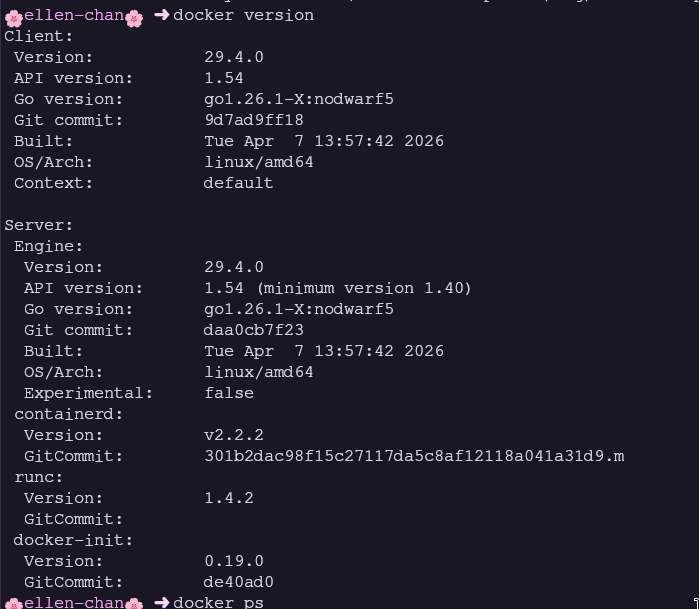
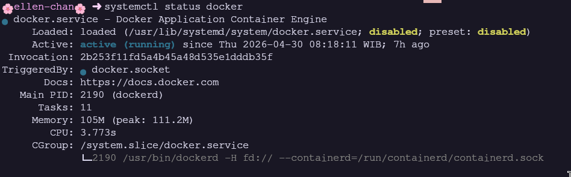
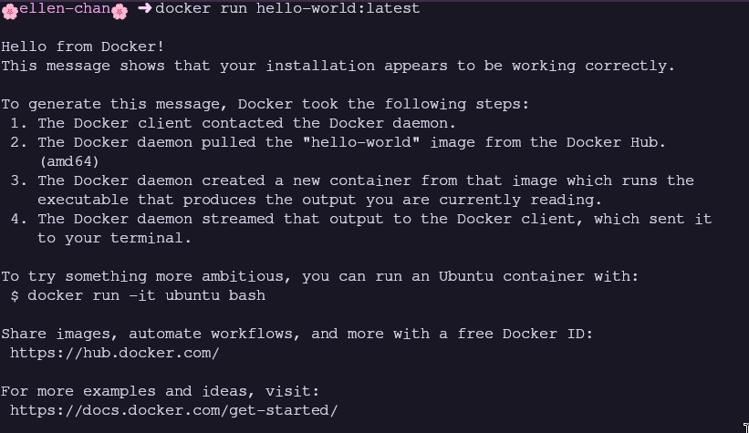
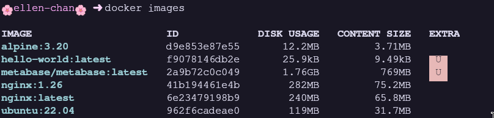
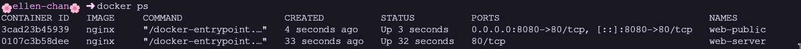
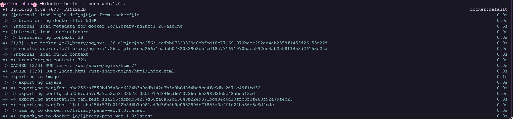

# Modul 1: Docker dan Instalasi

> **Nama:** Daffi Achmad Wijayanto

## Ringkasan Modul

Modul ini mengulas pengenalan Docker, perbedaan antara virtualisasi tradisional (VM) dan kontainerisasi, arsitektur Docker Engine, serta langkah-langkah instalasi Docker di Ubuntu 22.04 dan Windows 10/11 dengan WSL2. Praktikum mencakup operasi dasar Docker meliputi manajemen image, pengelolaan siklus hidup container, dan pembuatan image kustom menggunakan Dockerfile.

## 1.1 Tujuan Pembelajaran dan Dasar Teori

Modul 1 disusun agar mahasiswa mampu: (1) Menjelaskan perbedaan mendasar antara virtualisasi tradisional (VM) dan kontainerisasi; (2) Memahami arsitektur Docker: Docker Engine, Docker Daemon, Docker CLI, dan Docker Registry; (3) Menginstal Docker Engine di Ubuntu 22.04 menggunakan repositori resmi; (4) Menginstal Docker Desktop di Windows 10/11 dengan WSL2 backend; (5) Menjalankan container pertama dan memahami siklus hidup container; (6) Menggunakan perintah dasar Docker; (7) Memahami konsep Docker Image, Layer, dan Docker Hub sebagai registry umum; (8) Menulis Dockerfile sederhana dan melakukan build image kustom.

### Analisis Teknis

Docker menawarkan model kontainerisasi yang lebih ringan dibanding virtualisasi tradisional. Container berbagi kernel Linux host dengan memanfaatkan mekanisme namespaces dan cgroups, sehingga proses startup memerlukan hitungan detik dengan ukuran image dalam satuan MB. Di sisi lain, VM membutuhkan hypervisor dan guest OS lengkap yang memakan ruang GB dengan startup dalam hitungan menit. Arsitektur Docker yang modular membuat pembagian peran antara client, daemon, dan runtime container menjadi lebih jelas.

## 1.2 Screenshot 1: Verifikasi Instalasi - docker version

_Gambar pendukung bersumber dari halaman 6 laporan asli._

### Uraian Langkah

Tahap awal setelah instalasi adalah memverifikasi bahwa Docker Engine telah terpasang dengan tepat. Perintah docker version menampilkan versi Docker Client dan Server (Docker Engine), API version, Go version, dan detail OS/Arch.

### Analisis Teknis

Hasil keluaran menampilkan dua bagian utama: Client (Docker CLI yang digunakan user) dan Server (Docker Engine/Daemon). Keduanya menampilkan versi, API version, Git commit, dan informasi build. Perbedaan versi yang signifikan antara Client dan Server dapat menyebabkan fitur tertentu tidak tersedia. Informasi OS/Arch menguatkan bahwa Docker berjalan di arsitektur yang sesuai (linux/amd64). Ini adalah verifikasi pertama bahwa instalasi berhasil.

## 1.3 Screenshot 2: Status Docker Service - systemctl status docker

_Gambar pendukung bersumber dari halaman 6 laporan asli._

### Uraian Langkah

Perintah sudo systemctl status docker digunakan untuk memastikan Docker Daemon dalam keadaan active (running). Tangkapan layar menunjukkan output systemctl yang menampilkan status: loaded, active (running), dan enabled (auto-start saat boot).

### Analisis Teknis

Status active (running) menandakan Docker Daemon berjalan dengan baik. Status enabled berarti Docker akan otomatis start saat sistem boot, yang penting untuk server produksi. Output juga menampilkan PID, task, memory usage, dan log terbaru. Jika status menampilkan inactive atau failed, semua perintah docker akan gagal dengan pesan 'Cannot connect to the Docker daemon'. Troubleshooting: sudo systemctl start docker dan sudo systemctl enable docker.

## 1.4 Screenshot 3: Test Container Pertama - docker run hello-world

_Gambar pendukung bersumber dari halaman 7 laporan asli._

### Uraian Langkah

Perintah docker run hello-world merupakan test standar untuk memverifikasi bahwa Docker Engine dapat menjalankan container. Image hello-world ( 5KB) menampilkan pesan konfirmasi dan penjelasan langkah-langkah yang dilakukan Docker.

### Analisis Teknis

Output 'Hello from Docker!' membuktikan bahwa seluruh pipeline Docker berfungsi sebagaimana mestinya: (1) Docker Client berkomunikasi dengan Docker Daemon; (2) Docker Daemon melakukan pull image dari Docker Hub; (3) Docker Daemon membuat container baru dari image; (4) Container dieksekusi dan output dikembalikan ke terminal. Pesan penjelasan mendeskripsikan setiap langkah secara rinci. Ini adalah validasi end-to-end paling sederhana.

## 1.5 Screenshot 4: Daftar Image Lokal - docker images

_Gambar pendukung bersumber dari halaman 8 laporan asli._

### Uraian Langkah

Setelah pull beberapa image dari Docker Hub (nginx, ubuntu:22.04, alpine:3.20), perintah docker images menampilkan daftar image lokal. Tangkapan layar menunjukkan REPOSITORY, TAG, IMAGE ID, CREATED, dan SIZE.

### Analisis Teknis

Perbedaan ukuran image cukup besar: alpine:3.20 ( 7MB) vs ubuntu:22.04 ( 77MB) - perbedaan 11 kali lipat. Alpine menggunakan musl libc dan BusyBox yang minimalis, Ubuntu menggunakan glibc dengan utilities lengkap. Untuk produksi, image kecil berarti deployment lebih cepat, lebih hemat bandwidth, dan permukaan serangan lebih kecil. Tag spesifik (nginx:1.26) lebih disarankan dibanding latest karena immutable dan menjamin reproducibility.

## 1.6 Screenshot 5: Container Berjalan - docker ps dengan Port Mapping

_Gambar pendukung bersumber dari halaman 8 laporan asli._

### Uraian Langkah

Container nginx dijalankan dalam detached mode (-d) dengan nama web-public dan port mapping 8080:80. Perintah docker ps menampilkan container yang sedang berjalan dengan informasi container ID, image, status (Up), dan port mapping.

### Analisis Teknis

Opsi `-d` (detached mode) menjalankan container di background. Opsi `--name` memberi nama mudah diingat. Opsi `-p` 8080:80 memetakan port 8080 host ke port 80 container melalui iptables NAT. Kolom STATUS pada output menampilkan 'Up X minutes'. Container ID adalah 12 karakter pertama SHA256. Jika tidak ada port mapping, container hanya bisa diakses dari dalam host melalui container IP internal.

## 1.7 Screenshot 6: Akses Nginx via Browser - `http://localhost:8080`

_Gambar pendukung bersumber dari halaman 9 laporan asli._

### Uraian Langkah

Halaman default Nginx diakses melalui browser di `http://localhost:8080`. Tangkapan layar menunjukkan halaman 'Welcome to nginx!' yang membuktikan bahwa web server berjalan di dalam container dan dapat diakses dari host melalui port yang di-mapping.

### Analisis Teknis

Halaman default Nginx adalah index.html bawaan image di /usr/share/nginx/html/. Akses dari browser membuktikan bahwa port mapping bekerja secara transparan - request ke localhost:8080 diteruskan Docker proxy ke container port 80. Browser menampilkan informasi versi Nginx dan konfirmasi bahwa server berjalan. Hal ini menunjukkan kemudahan melakukan deployment web server di container tanpa perlu konfigurasi jaringan yang rumit.

## 1.8 Screenshot 7: Build Custom Image - docker build -t pens-web:1.0

_Gambar pendukung bersumber dari halaman 9 laporan asli._

### Uraian Langkah

Dockerfile dibuat berdasarkan image dasar nginx:1.26-alpine dengan instruksi LABEL, RUN, COPY, EXPOSE, dan CMD. Tangkapan layar menunjukkan proses build yang berhasil, setiap step menampilkan instruksi dan hash layer yang dihasilkan.

### Analisis Teknis

Proses build memperlihatkan step Dockerfile secara runtut: FROM mengambil image dasar, LABEL menambah metadata, RUN mengeksekusi rm, COPY menyalin file custom, EXPOSE mendokumentasikan port, CMD mendefinisikan perintah default. Setiap instruksi yang memodifikasi filesystem membentuk layer baru yang di-cache. Output 'Successfully built' dan 'Successfully tagged' menguatkan image siap dijalankan. Cache layer mempercepat proses build selanjutnya.

## 1.9 Screenshot 8: Akses Custom Web App - `http://localhost:9090`

_Gambar pendukung bersumber dari halaman 10 laporan asli._

### Uraian Langkah

Container dari image kustom pens-web:1.0 dijalankan dengan port mapping 9090:80. Tangkapan layar menunjukkan halaman 'Docker Lab PENS' custom yang diakses melalui browser, dengan desain gradien, hostname container, dan informasi server.

### Analisis Teknis

Custom image berhasil dan menampilkan halaman yang dibuat secara khusus. Hostname container ditampilkan via JavaScript location.hostname, membuktikan bahwa halaman ditampilkan dari container yang sesuai. Ini membuktikan bahwa Dockerfile berhasil: mengubah konten bawaan dengan halaman custom, menjalankan Nginx dengan konfigurasi yang tepat, dan port 80 container berhasil di-mapping ke port 9090 host.

## 1.10 Jawaban Post-Lab Modul 1 (Bagian 1)

Berikut jawaban dan pembahasan untuk pertanyaan post-lab Modul 1 nomor 1-3.

### Pembahasan Jawaban

1. Perbandingan docker image history nginx dan pens-web:1.0 - Layer yang di-share: seluruh layer dari image dasar nginx:1.26-alpine. Docker menggunakan layered filesystem di mana setiap instruksi menghasilkan layer read-only yang dapat di-share. pens-web:1.0 hanya menambahkan layer baru (LABEL, RUN rm, COPY, CMD) di atas image dasar. docker image history menampilkan ukuran 0B pada layer shared. Keuntungan: penghematan disk signifikan ketika banyak image kustom menggunakan image dasar yang sama.
2. Data setelah docker rm: data di writable container layer hilang permanen. Container menggunakan Union Filesystem - semua perubahan ditulis ke thin writable layer yang dihapus bersama container. Solusi: Docker Volume (/var/lib/docker/volumes/), Bind Mount (path host arbitrary), atau tmpfs (RAM). Volume adalah solusi paling portabel dan direkomendasikan untuk data produksi.
3. EXPOSE vs -p: EXPOSE adalah dokumentasi (informatif), tidak membuka port. Opsi `-p` melakukan port mapping dan forwarding melalui iptables NAT. EXPOSE berguna untuk komunikasi antar container di network yang sama. EXPOSE saja tidak cukup untuk akses dari host - diperlukan -p atau -P.

## 1.11 Jawaban Post-Lab Modul 1 (Bagian 2)

Berikut jawaban dan pembahasan untuk pertanyaan post-lab Modul 1 nomor 4-5.

### Pembahasan Jawaban

4. Tag spesifik vs latest: tag spesifik (nginx:1.26) lebih baik untuk produksi karena: (a) Reproducibility - build hari ini sama dengan build besok; (b) Keamanan - upgrade terencana dengan testing; (c) Rollback - tahu versi sebelumnya yang berfungsi sebagaimana mestinya; (d) Debugging - tahu versi pasti. Tag latest bersifat mutable, selalu menunjuk ke versi terbaru, bisa berubah tanpa sepengetahuan.
5. alpine:3.20 vs ubuntu:22.04: Alpine 7MB, Ubuntu 77MB (11x lipat). Kelebihan Alpine: sangat kecil, deployment lebih cepat, permukaan serangan lebih kecil, apk package manager cepat, hemat resource. Kekurangan: menggunakan musl libc (bukan glibc) yang bisa menyebabkan masalah kompatibilitas dengan binary yang dikompilasi untuk glibc, beberapa Python C extensions memerlukan kompilasi ulang. Untuk aplikasi interpreted (Python, Node.js), Alpine adalah pilihan sangat baik.
