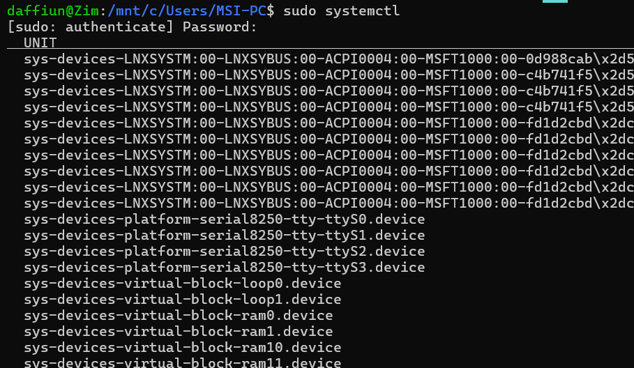
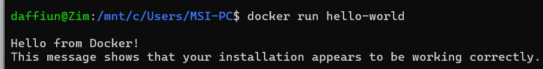
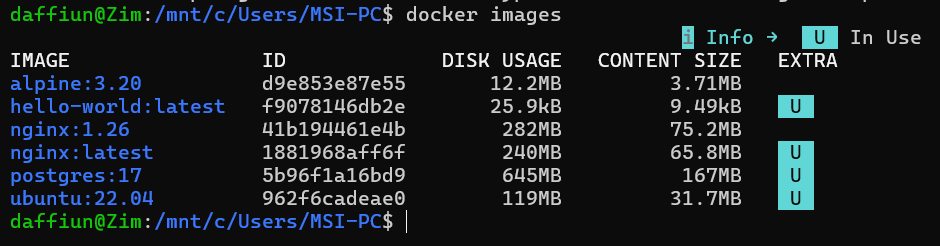
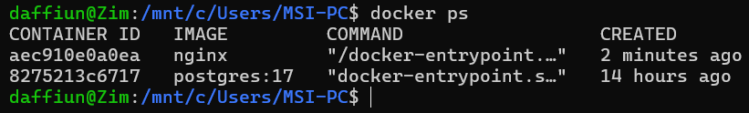
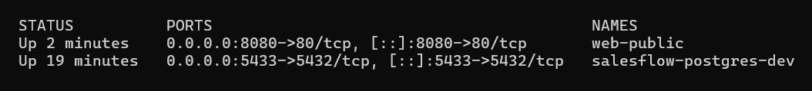
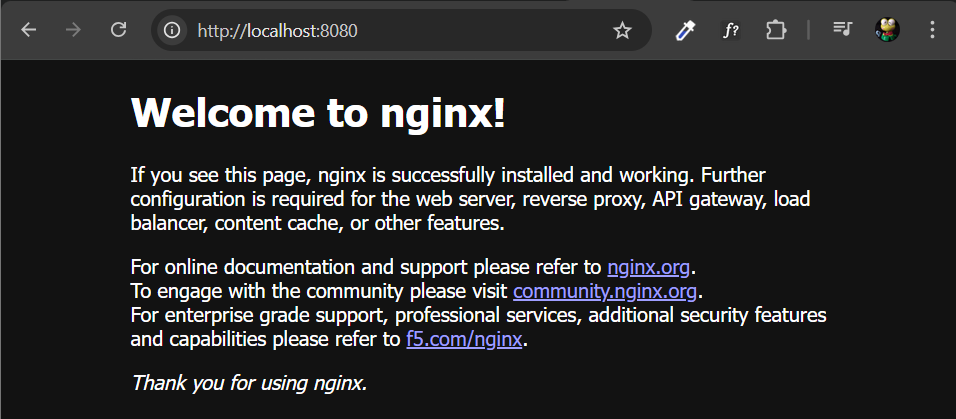
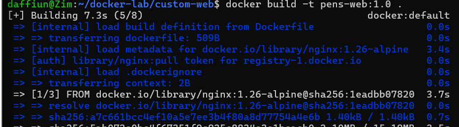
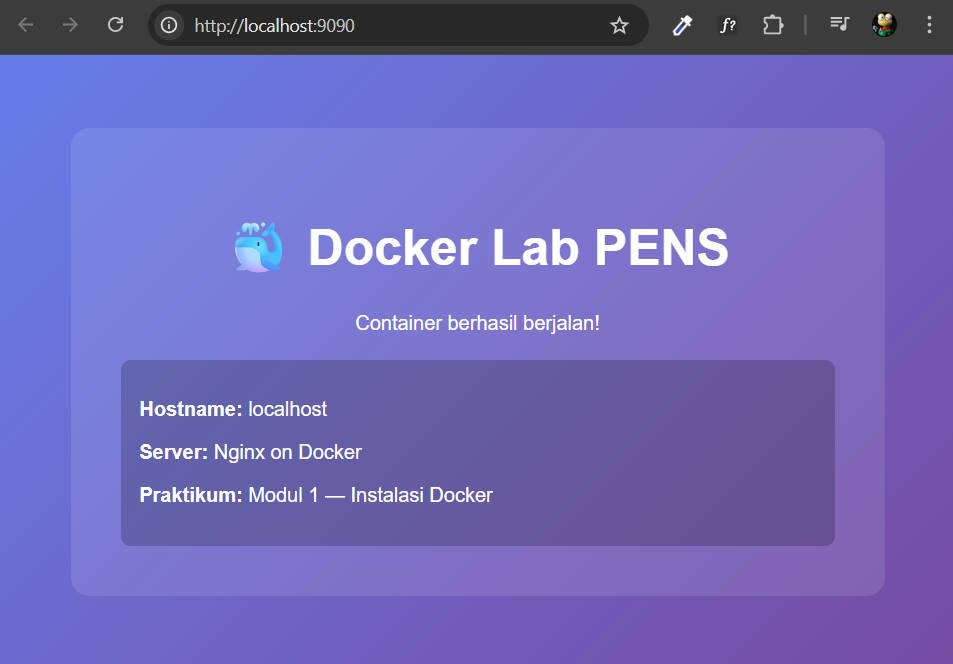
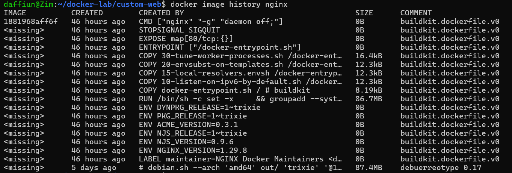
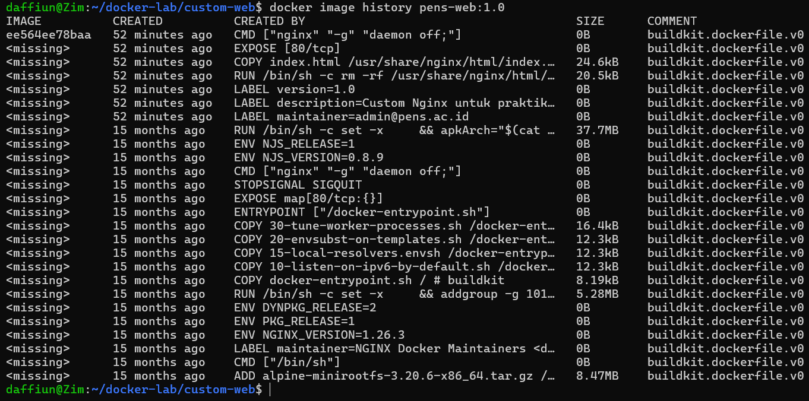

# Modul 1: Instalasi Docker
1.  docker version - client dan server

daffiun@Zim:/mnt/c/Users/MSI-PC$ docker version
Client: Docker Engine - Community
Version: 29.4.3
API version: 1.54
Go version: go1.26.2
Git commit: 055a478
Built: Wed May 6 17:07:26 2026
OS/Arch: linux/amd64
Context: default
Server: Docker Desktop 4.71.0 (225177)
Engine:
Version: 29.4.1
API version: 1.54 (minimum version 1.40)
Go version: go1.26.2
Git commit: 6c91b92
Built: Mon Apr 20 16:32:41 2026
OS/Arch: linux/amd64
Experimental: false
containerd:
Version: v2.2.3
GitCommit: 77c84241c7cbdd9b4eca2591793e3d4f4317c590
runc:
Version: 1.3.5
GitCommit: v1.3.5-0-g488fc13e
docker-init:
Version: 0.19.0
GitCommit: de40ad0

2.  sudo systemctl status docker — service active (running)

3.  docker run hello-world — pesan sukses lengkap

4.  docker images — daftar image yang sudah di-pull

5.  docker ps — container nginx berjalan dengan port mapping

6.  Browser mengakses http://localhost:8080 — halaman Nginx default

7.  docker build -t pens-web:1.0 . — proses build berhasil (step terakhir)

8.  Browser mengakses http://localhost:9090 — halaman custom PENS

9.  Soal Post Lab

1.  Bandingkan output docker image history nginx dengan docker image history pens-web:1.0. Layer mana saja yang di-share?

Tidak ada layer yang share secara langsung antara nginx dan pens-web:1.0

2.  Apa yang terjadi pada data di dalam container setelah container dihapus dengan docker rm? Bagaimana solusinya?

Data akan hilang semua karena container itu sifatnya sementara, solusinya adalah menggunakn docker volume atau bind mount. Dengan fitur ini, kita bisa menyimpan data container ke dalam folder khusus di OS Host (laptop/Ubuntu kamu). Jadi, biarpun containernya dihapus, datanya tetap aman di laptopmu dan bisa dipasang lagi ke container yang baru.

3.  Jelaskan perbedaan antara EXPOSE di Dockerfile dan flag -p pada docker run. Apakah EXPOSE cukup untuk membuat port dapat diakses dari host?

Expose di dockerfile cuma sekedar dokumentasi atau informasi sedangkan flag -p di docker run itu merupakan singkatan dari publish yang berguna untuk memetakkan port dari dalam container ke port di Host.
dengan Expose saja tidak cukup karena tidak akan membuat web bisa diakses dari localhost browser. kita wajib pakai flag -p saat menjalankan docker run agar portnya terhubung

4.  Mengapa menggunakan tag spesifik (misal nginx:1.26) lebih baik daripada nginx:latest untuk production?

Karena, untuk menjaga konsistensi versi yang ditarik, karena bisa jadi kemarin tari versi 1.26 nah hari ini tiba tiba ada update dan yang ditarik versi 1.27 dan kita tidak tahuh dan akhirnya crash.

5.  Berapa ukuran image alpine:3.20 dibanding ubuntu:22.04? Apa trade-off menggunakan Alpine?

Ukuran image alpine:3.20 sangat kecil, yakni sekitar 3.4 MB, sementara ubuntu:22.04 mencapai sekitar 28 MB, yang berarti Ubuntu hampir 8 kali lebih besar dari Alpine. Trade-off utama menggunakan Alpine terletak pada penggunaan musl libc sebagai pengganti glibc yang umum digunakan di Ubuntu; hal ini sering menyebabkan masalah kompatibilitas pada aplikasi dengan dependensi C kompleks (seperti Python library tertentu), performa eksekusi yang terkadang lebih lambat untuk beban kerja tertentu, serta ketersediaan paket di repositori apk yang tidak selengkap apt milik Ubuntu.
