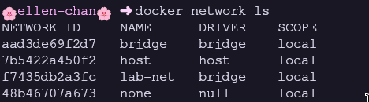
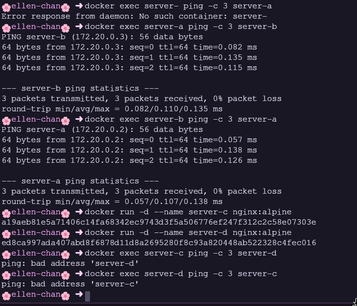
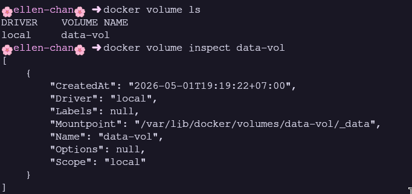
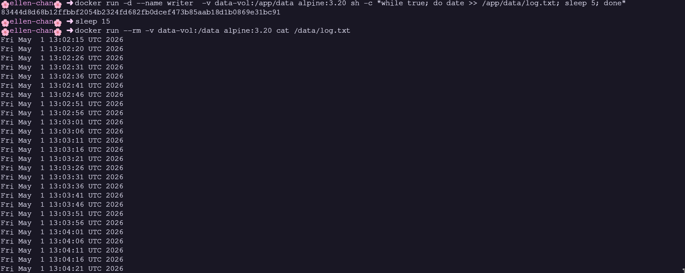
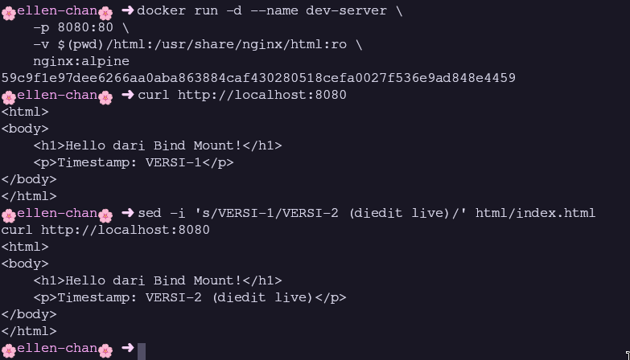
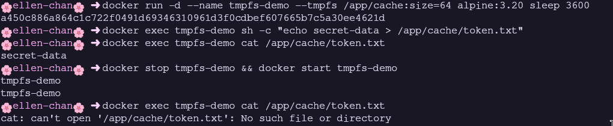
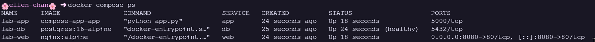
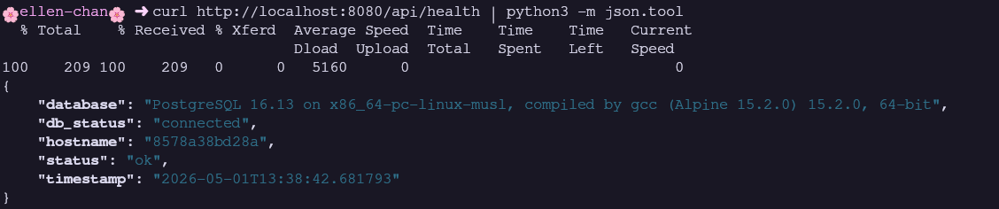
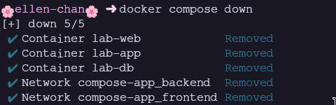

# Modul 2: Docker Service, Volume dan Mount Point

> **Nama:** Daffi Achmad Wijayanto

## Ringkasan Modul

Modul ini mengulas tiga komponen penting: Docker Network untuk komunikasi antar container, mekanisme Mount (Volume, Bind Mount, tmpfs) untuk persistensi data, serta Docker Compose untuk orkestrasi multi-container. Mahasiswa belajar user-defined bridge network dengan DNS resolution, manajemen Volume untuk data persistence, Bind Mount untuk live-reload pengembangan, dan menulis docker-compose.yml untuk stack Nginx-Flask-PostgreSQL.

## 2.1 Tujuan Pembelajaran dan Dasar Teori

Modul 2 disusun agar mahasiswa mampu: (1) Memahami dan mengelola Docker Network: bridge, host, none; (2) Menghubungkan container via user-defined bridge; (3) Memahami tiga jenis mount: Volume, Bind Mount, tmpfs; (4) Membuat dan mengelola Docker Volume; (5) Menggunakan Bind Mount untuk pengembangan; (6) Menginstal dan menggunakan Docker Compose; (7) Menulis docker-compose.yml; (8) Mengelola siklus hidup aplikasi multi-container. Data container bersifat ephemeral sehingga mekanisme mount diperlukan. Volume dikelola Docker, Bind Mount pakai path host, tmpfs di RAM.

### Analisis Teknis

User-defined bridge unggul karena DNS resolution otomatis - container bisa resolve by name. Docker Compose menyederhanakan orkestrasi dengan satu file YAML untuk seluruh stack. Memahami tiga jenis mount penting: Volume untuk data produksi (portabel, managed), Bind Mount untuk pengembangan (live-reload), tmpfs untuk data sensitif sementara (tidak tertulis ke disk).

## 2.2 Screenshot 1: Docker Network - docker network ls

_Gambar pendukung bersumber dari halaman 13 laporan asli._

### Uraian Langkah

User-defined bridge network lab-net dibuat dengan subnet 172.20.0.0/16. Tangkapan layar menunjukkan docker network ls yang menampilkan daftar network (bridge, host, none, lab-net) beserta driver dan scope.

### Analisis Teknis

Docker menawarkan tiga network default: bridge (default, NAT ke host), host (langsung pakai network host), none (tanpa network). User-defined bridge lab-net memberi keunggulan: DNS resolution otomatis, isolasi lebih baik, container bisa connect/disconnect saat running. Subnet kustom menghindari konflik dengan default bridge (172.17.0.0/16).

## 2.3 Screenshot 2: DNS Resolution - Ping antar Container by Name

_Gambar pendukung bersumber dari halaman 13 laporan asli._

### Uraian Langkah

Container server-a dan server-b dijalankan di network lab-net. docker exec server-a ping -c 3 server-b menguji DNS resolution. Tangkapan layar menampilkan ping berhasil: server-a resolve server-b ke 172.20.0.3 dengan reply berhasil. Container di default bridge tidak bisa resolve by name.

### Analisis Teknis

DNS resolution otomatis via embedded DNS server (127.0.0.11) di setiap container user-defined bridge. DNS otomatis mendaftarkan container_name -> IP_address. Default bridge tidak punya fitur ini (legacy). Dalam microservices, resolusi berbasis nama sangat kritis untuk service discovery tanpa infrastruktur tambahan.

## 2.4 Screenshot 3: Docker Volume - docker volume ls dan Inspect

_Gambar pendukung bersumber dari halaman 14 laporan asli._

### Uraian Langkah

Named volume data-vol dibuat dengan docker volume create. docker volume ls menampilkan daftar volume. docker volume inspect data-vol menampilkan detail JSON: driver local, mountpoint /var/lib/docker/volumes/data-vol/_data, scope local.

### Analisis Teknis

docker volume inspect menampilkan: Driver (local = filesystem host), Mountpoint (path aktual data), Scope (local = hanya host ini). Volume dikelola Docker, tidak terpengaruh siklus hidup container. Volume bisa di-backup dengan container sementara, di-restore ke volume baru, dan di-share antar container.

## 2.5 Screenshot 4: Volume Sharing - Data Dibaca dari Container Berbeda

_Gambar pendukung bersumber dari halaman 15 laporan asli._

### Uraian Langkah

Container writer menulis timestamp ke volume data-vol setiap 5 detik, lalu dihapus. Container reader membaca data dari volume yang sama. Tangkapan layar menampilkan output cat /data/log.txt berisi timestamp dari writer, membuktikan bahwa: (1) data shareable; (2) data persist setelah writer dihapus.

### Analisis Teknis

Eksperimen mendemonstrasikan data sharing dan persistence. Writer menulis via -v data-vol:/app/data, dihapus dengan docker rm -f. Reader me-mount volume sama dan berhasil baca data. Lifecycle data di volume independen dari siklus hidup container. Pola ini penting untuk database, shared storage, dan backup workflow.

## 2.6 Screenshot 5: Bind Mount - Live-Reload Development

_Gambar pendukung bersumber dari halaman 15 laporan asli._

### Uraian Langkah

Bind mount me-mount ./html host ke /usr/share/nginx/html container (:ro). Tangkapan layar menampilkan dua output curl: sebelum edit (VERSI-1) dan sesudah edit via sed (VERSI-2 diedit live). Perubahan langsung terlihat tanpa restart.

### Analisis Teknis

Bind mount bekerja di level kernel (mount bind), bukan copy. File diedit di host langsung terlihat di container real-time. Ideal untuk pengembangan: editor di host, aplikasi di container dengan dependencies terisolasi. Opsi :ro mencegah container modifikasi source code. Kelemahan: path-dependent (tidak portabel), potensi UID/GID conflict. Lingkungan produksi sebaiknya pakai COPY atau Volume.

## 2.7 Screenshot 6: tmpfs Mount - Data Hilang Setelah Restart

_Gambar pendukung bersumber dari halaman 16 laporan asli._

### Uraian Langkah

tmpfs mount menyimpan data di RAM (size=64m). Tangkapan layar menampilkan docker inspect pada container tmpfs-demo dengan Type: tmpfs, Destination, dan options. Setelah container stop lalu start, data hilang - file token.txt tidak ditemukan.

### Analisis Teknis

tmpfs menyimpan data di RAM host: (1) Hilang saat container stop (RAM volatile); (2) Sangat cepat tanpa I/O disk; (3) Tidak pernah tertulis ke disk - cocok untuk credential/token; (4) Bisa dibatasi ukuran. docker inspect menampilkan Type: tmpfs, tmpfs options (size, mode). Use case: temporary credentials, session tokens, cache sementara. Berbeda dengan volume/bind mount: data benar-benar tidak meninggalkan jejak di storage persistent.

## 2.8 Screenshot 7: Docker Compose - docker compose ps (3 Service)

_Gambar pendukung bersumber dari halaman 16 laporan asli._

### Uraian Langkah

docker-compose.yml mendefinisikan web (Nginx), app (Flask), db (PostgreSQL). Tangkapan layar menampilkan docker compose ps: ketiga service Up dan healthy. Informasi: NAME, IMAGE, COMMAND, SERVICE, STATUS, PORTS.

### Analisis Teknis

docker compose ps menampilkan status stack: container name konsisten (lab-web, lab-app, lab-db), STATUS menampilkan health state (db: healthy via pg_isready). PORTS: 0.0.0.0:8080->80/tcp. Output ini membuktikan bahwa docker compose up --build -d berhasil. Jika ada service restart terus, troubleshooting dimulai dari output ini.

## 2.9 Screenshot 8: Halaman Web - Browser di `http://localhost:8080`

_Gambar pendukung bersumber dari halaman 17 laporan asli._

### Uraian Langkah

Halaman 'Docker Compose Lab' diakses via browser. Tangkapan layar menampilkan halaman dengan tombol 'Cek Koneksi Backend' dan area result. Frontend statis disajikan Nginx, yang via JavaScript fetch() memanggil Flask API di /api/health.

### Analisis Teknis

Frontend HTML statis di-mount via bind mount. Tombol memicu fetch ke /api/health - Nginx reverse-proxy request ke Flask (proxy_pass http://app:5000). Arsitektur standar: Nginx sajikan static assets + reverse-proxy API ke backend. Pemisahan frontend/backend memungkinkan scaling independen. Card layout dan monospace result box memberikan UI yang rapi.

## 2.10 Screenshot 9: API Response - curl /api/health (Database Connected)

_Gambar pendukung bersumber dari halaman 17 laporan asli._

### Uraian Langkah

API endpoint /api/health via curl. Tangkapan layar menampilkan JSON response: status ok, hostname container Flask, timestamp, database version PostgreSQL, db_status connected. Bukti konektivitas end-to-end.

### Analisis Teknis

JSON membuktikan bahwa: Nginx reverse-proxy ke Flask, Flask koneksi ke PostgreSQL via hostname db (DNS resolution), query SELECT version() berhasil. Environment variable (DB_HOST, DB_NAME, DB_USER, DB_PASS) diteruskan dengan tepat. db_status 'connected' menguatkan health check berfungsi sebagaimana mestinya. Response ini memvalidasi seluruh stack.

## 2.11 Screenshot 10: Cleanup - docker compose down

_Gambar pendukung bersumber dari halaman 18 laporan asli._

### Uraian Langkah

docker compose down menghentikan dan membersihkan stack. Tangkapan layar menampilkan proses stop dan remove container (lab-web, lab-app, lab-db) serta network. Volume pg-data tetap dipertahankan.

### Analisis Teknis

docker compose down membersihkan container dan network, tanpa menghapus volume. Hasil keluaran menampilkan setiap service di-stop dan di-remove. Volume pg-data tetap ada (verifikasi: docker volume ls). Untuk cleanup total termasuk volume: docker compose down -v (hati-hati: data hilang permanen). down vs stop: stop hanya hentikan container (bisa start lagi), down hapus container dan network (perlu up lagi).

## 2.12 Jawaban Post-Lab Modul 2 (Bagian 1)

Berikut jawaban dan pembahasan untuk pertanyaan post-lab Modul 2 nomor 1-3.

### Pembahasan Jawaban

1. docker network inspect lab-net: Menampilkan konfigurasi network JSON termasuk container terhubung dan IP. Di stack compose, network frontend berisi lab-web (172.20.0.2) dan lab-app (172.20.0.3). Network backend berisi lab-app (172.21.0.2) dan lab-db (172.21.0.3). lab-app punya dua IP karena terhubung ke dua network, berfungsi sebagaimana mestinya sebagai application-level gateway.
2. docker compose down lalu up - data PostgreSQL tetap ada. docker compose down tanpa `-v` tidak menghapus volume pg-data. Container baru me-mount volume yang sama, PostgreSQL mendeteksi PGDATA valid dan langsung gunakan data existing tanpa re-inisialisasi. Ini membuktikan bahwa Volume adalah solusi persistensi yang tepat.
3. Perbedaan docker inspect volume vs bind: Volume - Type: volume, Name: data-vol, Source: /var/lib/docker/volumes/data-vol/_data. Bind - Type: bind, Source: /home/user/docker-lab/web-dev/html (path host). Volume dikelola Docker (portabel, driver, backup), Bind Mount langsung ke path host (tidak portabel, permission host-dependent).

## 2.13 Jawaban Post-Lab Modul 2 (Bagian 2)

Berikut jawaban dan pembahasan untuk pertanyaan post-lab Modul 2 nomor 4-5.

### Pembahasan Jawaban

4. Alur request: Browser -> `http://localhost:8080` -> Docker host -> lab-web:80 (Nginx). Nginx evaluasi path: / sajikan static file; /api/* reverse-proxy ke http://app:5000 (DNS resolve lab-app). Flask proses request, buka koneksi ke PostgreSQL di hostname db (resolve lab-db):
5432. PostgreSQL proses query, kembalikan hasil ke Flask. Flask format JSON, kirim ke Nginx, diteruskan ke browser. Setiap hop pakai service name via DNS.
5. Ukuran image: python:3.11-slim TERBESAR ( 130MB) karena Python runtime + library sistem. postgres:16-alpine ( 250MB) karena binary database engine besar. nginx:alpine ( 45MB) terkecil karena single-purpose binary. python:3.11-slim dipilih daripada alpine karena psycopg2-binary sering bermasalah dengan musl libc. Ini trade-off: kompatibilitas vs ukuran.
