# Modul 2: Service Mount Docker
1.  docker network ls

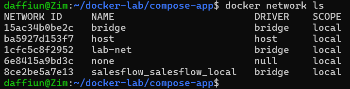

2.  ping antar container by nama

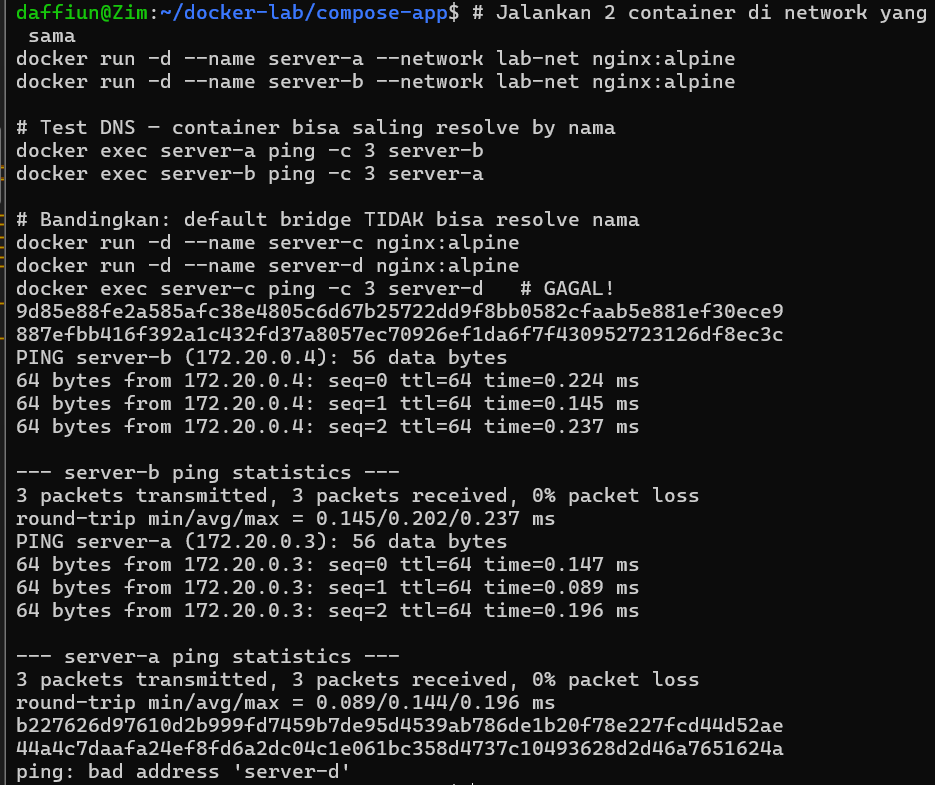

3.  docker volume ls + inspect

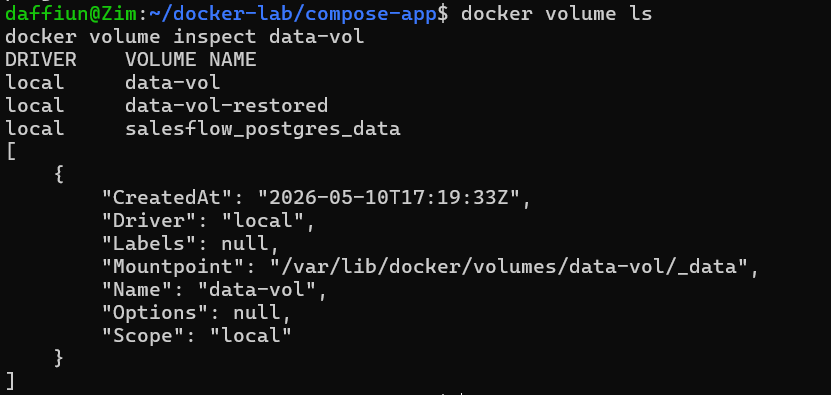

4.  Volume sharing antar container

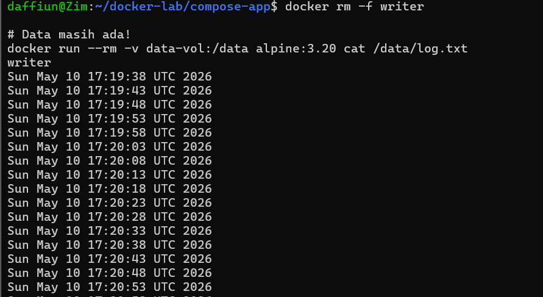

5.  Bind mount live-reload (sebelum/sesudah edit)

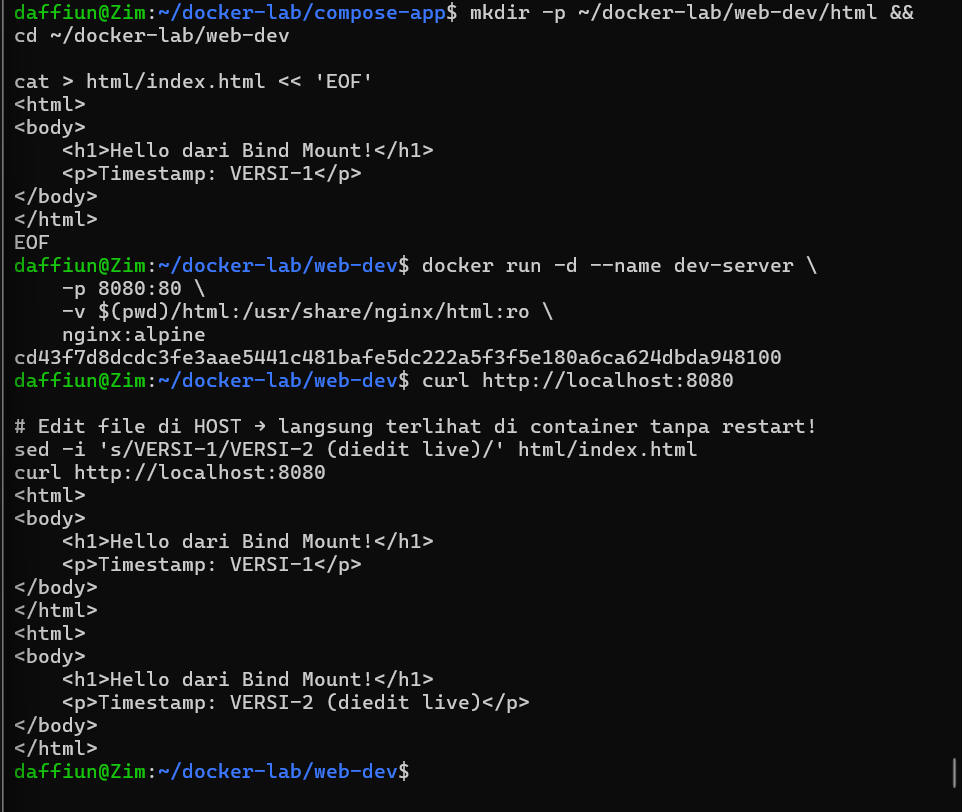

6.  tmpfs inspect

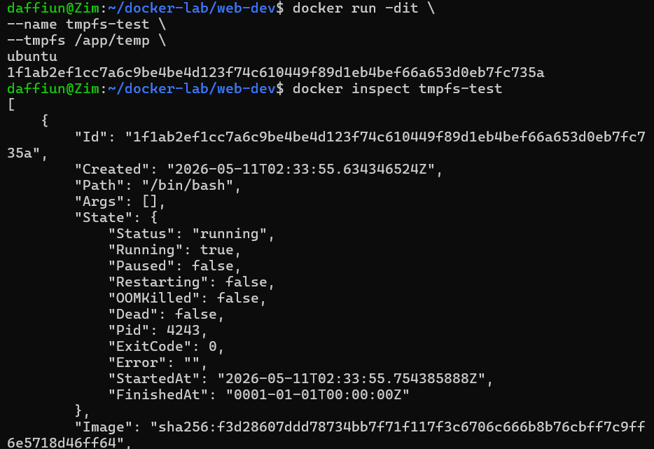

7.  docker compose ps

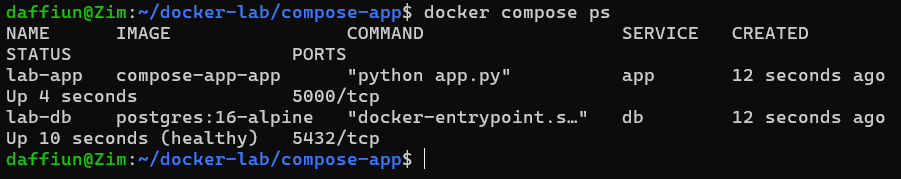

8.  Browser halaman web

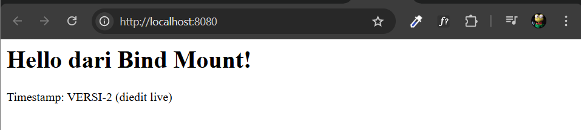

9.  curl /api/health response

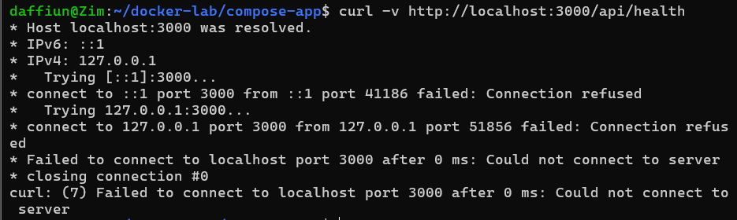

10. docker compose down

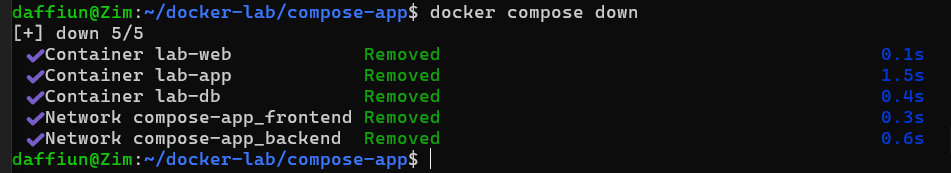

11. Post Lab

1.  Jalankan docker network inspect lab-frontend. Sebutkan container dan IP masing-masing.

Karena lab-frontend tidak ada maka saya ganti inspect ke lab-net
dimana ada 3 container yang terhubung yaitu
container 1 172.20.0.2/16
server-a 172.20.0.3/16
server-b 172.20.0.4/16

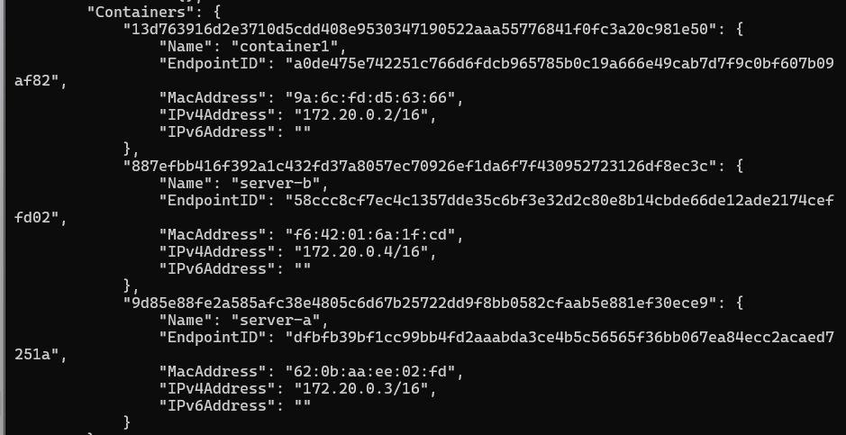

2.  Hapus container lab-db lalu docker compose up -d lagi. Apakah data PostgreSQL masih ada? Mengapa?

Data masih ada setelah container dihapis lalu dijalankan docker compose up lagi karena postgre sql menggunakn docker volume untuk menyimpan data secara persiten

3.  Tunjukkan perbedaan output docker inspect untuk mount type volume vs bind

tipe volume

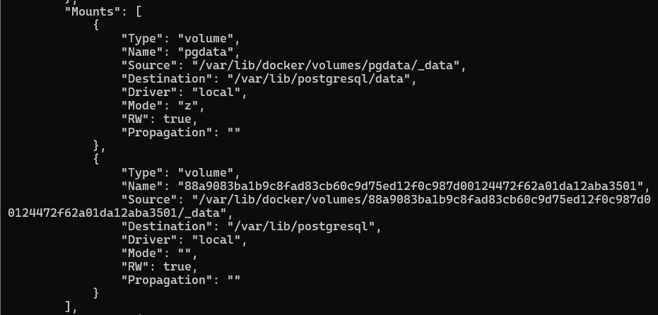

tipe bind

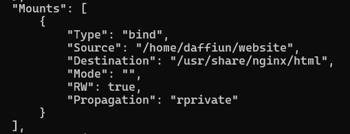

4.  Jelaskan alur request dari browser → Nginx → Flask → PostgreSQL.

Alur request dari browser sampai ke PostgreSQL itu awalnya user membuka website melalui browser misalnya localhost, lalu request dari browser masuk ke container Nginx yang bertugas sebagai web server sekaligus reverse proxy. Setelah Nginx menerima request, jika request tersebut mengarah ke API seperti /api/users atau /api/health, maka Nginx akan meneruskan request tersebut ke container Flask melalui Docker network menggunakan nama service/container tanpa perlu IP manual. Setelah request diterima Flask, backend akan menjalankan logic aplikasi seperti validasi data, proses perhitungan, atau mengambil data dari database. Jika membutuhkan data, Flask akan melakukan query SQL ke PostgreSQL yang berada di container database dalam network Docker yang sama. PostgreSQL kemudian memproses query seperti SELECT, INSERT, UPDATE, atau DELETE lalu mengembalikan hasilnya ke Flask. Setelah itu Flask mengubah hasil tersebut menjadi response API biasanya dalam bentuk JSON, lalu response dikirim kembali ke Nginx dan diteruskan lagi ke browser sehingga hasil akhirnya dapat ditampilkan ke user. Jadi alurnya berjalan berurutan dari Browser → Nginx → Flask → PostgreSQL lalu kembali lagi ke Browser.

5.  Bandingkan ukuran image yang digunakan stack ini. Mana terbesar dan mengapa?
