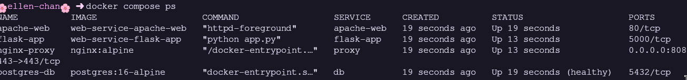
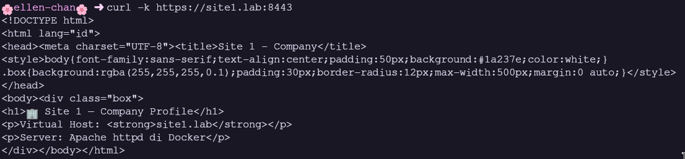
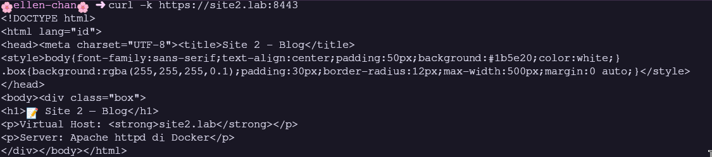
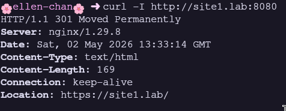
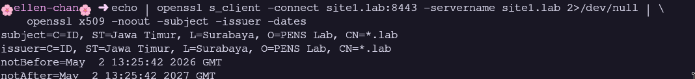
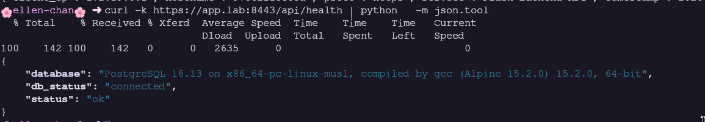
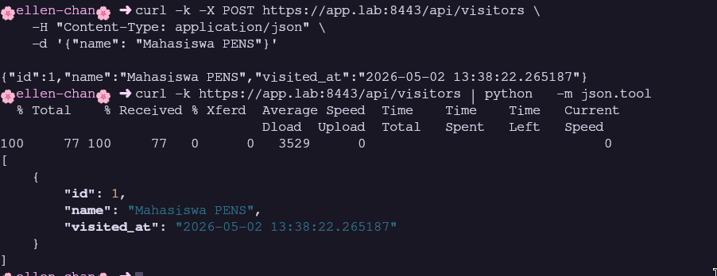
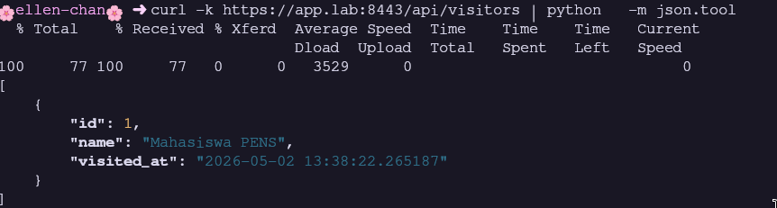
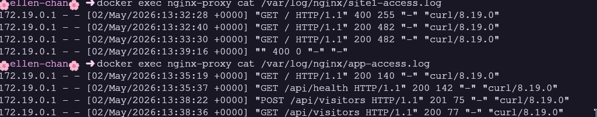
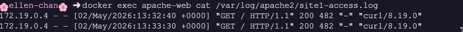

# Modul 3: Web Service di Docker - Apache dan Nginx

> **Nama:** Daffi Achmad Wijayanto

## Ringkasan Modul

Modul ini mengulas deployment Apache2 (httpd) dan Nginx sebagai container Docker dengan konfigurasi custom, Virtual Host, SSL/TLS, dan Reverse Proxy. Mahasiswa belajar Virtual Host name-based, SSL Termination dengan sertifikat self-signed, Nginx reverse proxy untuk backend (Apache dan Flask), persistent logging per-site, dan orkestrasi stack 4 service dengan Docker Compose.

## 3.1 Tujuan Pembelajaran dan Dasar Teori

Modul 3 disusun agar mahasiswa mampu: (1) Men-deploy Apache2 (httpd) di container; (2) Men-deploy Nginx dengan konfigurasi custom; (3) Membuat Virtual Host name-based; (4) Mengkonfigurasi SSL/TLS dengan sertifikat self-signed; (5) Nginx sebagai reverse proxy; (6) Membandingkan Apache vs Nginx; (7) Persistent logging; (8) Orkestrasi stack dengan Docker Compose. Apache: process/thread per request. Nginx: event-driven async - lebih efisien untuk koneksi konkuren tinggi.

### Analisis Teknis

Web server di container memberi isolasi konfigurasi, easy scaling, reproducible environment. SSL Termination di reverse proxy menyederhanakan manajemen sertifikat (hanya satu tempat). Komunikasi ke backend bisa HTTP biasa di network internal. Self-signed certificate cukup untuk lab; produksi perlu CA trusted (Let's Encrypt). Virtual Host name-based memungkinkan satu server melayani banyak domain via header HTTP Host.

## 3.2 Screenshot 1: docker compose ps - 4 Service Running

_Gambar pendukung bersumber dari halaman 20 laporan asli._

### Uraian Langkah

Stack: nginx-proxy (reverse proxy + SSL), apache-web (Apache Virtual Host), flask-app (Flask API), postgres-db (PostgreSQL). Tangkapan layar menampilkan docker compose ps: 4 service Up dan healthy. Dua network: web-net dan db-net.

### Analisis Teknis

Arsitektur defense-in-depth: database diisolasi di db-net (hanya Flask yang akses). Nginx proxy single entry point di port 8080 (HTTP) dan 8443 (HTTPS). Apache tidak exposed ke host - hanya bisa diakses via Nginx. Flask terhubung ke dua network sebagai application gateway. Healthcheck memastikan startup order tepat.

## 3.3 Screenshot 2: Virtual Host Apache - curl site1.lab (Company Profile)

_Gambar pendukung bersumber dari halaman 21 laporan asli._

### Uraian Langkah

Apache dengan dua Virtual Host name-based. Tangkapan layar menampilkan curl -k https://site1.lab:8443 yang mengembalikan halaman Company Profile (tema biru). Nginx proxy meneruskan request dengan header Host: site1.lab ke apache-web:80.

### Analisis Teknis

Virtual Host membaca header Host (diteruskan Nginx via proxy_set_header Host) untuk menentukan site mana yang merespons. Halaman Company Profile tema biru (1a237e). Curl -k diperlukan karena sertifikat self-signed. Response HTML lengkap membuktikan bahwa Apache dan Virtual Host routing berfungsi sebagaimana mestinya. Document root berbeda untuk tiap site.

## 3.4 Screenshot 3: Virtual Host Apache - curl site2.lab (Blog)

_Gambar pendukung bersumber dari halaman 21 laporan asli._

### Uraian Langkah

Virtual Host site2.lab menampilkan halaman Blog (tema hijau). Tangkapan layar menampilkan curl -k https://site2.lab:8443 dengan konten berbeda dari site1. Membuktikan Virtual Host name-based berfungsi sebagaimana mestinya dengan tepat.

### Analisis Teknis

Site 2: document root /usr/local/apache2/htdocs/site2, tema hijau (1b5e20). Kedua Virtual Host di file vhosts.conf dengan ServerName masing-masing. Logging per-site (site1-access.log, site2-access.log) untuk analisis traffic terpisah. Pola ini umum dalam shared hosting: satu server melayani banyak website dengan domain berbeda.

## 3.5 Screenshot 4: HTTP ke HTTPS Redirect - curl -I (301 Moved)

_Gambar pendukung bersumber dari halaman 22 laporan asli._

### Uraian Langkah

Nginx mengkonfigurasi HTTP-to-HTTPS redirect. Tangkapan layar menampilkan curl -I http://site1.lab:8080: HTTP/1.1 301 Moved Permanently, Location: https://site1.lab/. Semua traffic HTTP otomatis dialihkan ke HTTPS.

### Analisis Teknis

301 redirect via return 301 https://$host$request_uri di server block HTTP (listen 80). Opsi -I (HEAD request) ambil header saja. Response: kode 301, Location header, Server: nginx. Redirect di level proxy - backend tidak perlu handle redirect logic. Semua koneksi selanjutnya via HTTPS, melindungi data in transit.

## 3.6 Screenshot 5: SSL Certificate - openssl s_client dan x509 Detail

_Gambar pendukung bersumber dari halaman 22 laporan asli._

### Uraian Langkah

Self-signed certificate dengan SAN *.lab, site1.lab, site2.lab, app.lab. Tangkapan layar menampilkan detail certificate via openssl: subject (C=ID, ST=Jawa Timur, L=Surabaya, O=PENS Lab, CN=*.lab), issuer, validity 365 hari, SAN.

### Analisis Teknis

Subject dan Issuer sama (self-signed). Wildcard certificate (*.lab) mencakup semua subdomain. SAN (Subject Alternative Name) memungkinkan certificate valid untuk multiple hostnames. Browser warning karena tidak ditandatangani CA trusted - normal untuk pengembangan. openssl s_client -servername untuk SNI (Server Name Indication).

## 3.7 Screenshot 6: Flask API Health Check - /api/health JSON

_Gambar pendukung bersumber dari halaman 23 laporan asli._

### Uraian Langkah

Flask endpoint /api/health. Tangkapan layar menampilkan curl -k https://app.lab:8443/api/health: JSON dengan status ok, hostname, timestamp, client_ip (dari X-Real-IP), proto https, database version, db_status connected.

### Analisis Teknis

Full chain connectivity: Nginx -> Flask -> PostgreSQL. hostname adalah container ID Flask. client_ip dari X-Real-IP header (diteruskan Nginx). proto dari X-Forwarded-Proto. database menampilkan versi PostgreSQL lengkap. db_status 'connected' - health check berfungsi sebagaimana mestinya. Header forwarding penting agar backend tahu konteks request asli.

## 3.8 Screenshot 7: API CRUD - POST /api/visitors (Response 201)

_Gambar pendukung bersumber dari halaman 23 laporan asli._

### Uraian Langkah

POST /api/visitors dengan JSON body name. Tangkapan layar menampilkan response HTTP 201 Created: id, name, visited_at timestamp. Data visitor berhasil disimpan ke PostgreSQL via Flask.

### Analisis Teknis

HTTP 201 Created menandakan resource berhasil dibuat. SERIAL PRIMARY KEY auto-increment. visited_at via DEFAULT CURRENT_TIMESTAMP PostgreSQL. INSERT ... RETURNING id, visited_at - fitur PostgreSQL yang mengembalikan row baru dalam satu query. CREATE TABLE IF NOT EXISTS di Flask untuk auto-migration. Lingkungan produksi: gunakan Alembic untuk migration.

## 3.9 Screenshot 8: API CRUD - GET /api/visitors (Daftar Visitor)

_Gambar pendukung bersumber dari halaman 24 laporan asli._

### Uraian Langkah

GET /api/visitors mengembalikan daftar visitor. Tangkapan layar menampilkan JSON array dengan id, name, visited_at, diurutkan id DESC. Data termasuk visitor yang baru di-POST, membuktikan bahwa persistensi.

### Analisis Teknis

SELECT ... ORDER BY id DESC LIMIT 20 - 20 visitor terbaru. Response JSON array membuktikan bahwa data POST tersimpan persistent dan dapat dibaca kembali. Psycopg2 fetchall() return list of tuples dikonversi ke dicts. Limit 20 mencegah response terlalu besar. Tabel visitors berfungsi sebagaimana mestinya sebagai log kunjungan sederhana.

## 3.10 Screenshot 9: Log Nginx per-Site - site1-access.log

_Gambar pendukung bersumber dari halaman 24 laporan asli._

### Uraian Langkah

Logging per-site di Nginx via access_log directive. Tangkapan layar menampilkan isi site1-access.log: timestamp, IP, method, path, status code, user agent. Log disimpan di volume nginx-logs.

### Analisis Teknis

Nginx access log format combined: $remote_addr, $time_local, $request, $status, $body_bytes_sent, $http_referer, $http_user_agent. Log per-site memungkinkan analisis traffic terpisah. Volume nginx-logs memastikan persistence. Untuk produksi: forward ke centralized logging system (Fluentd/Loki).

## 3.11 Screenshot 10: Log Apache per-Site - site1-access.log (Combined)

_Gambar pendukung bersumber dari halaman 25 laporan asli._

### Uraian Langkah

Apache logging per-site via CustomLog directive di Virtual Host. Tangkapan layar menampilkan log Apache dalam format combined. Client IP tercatat adalah IP Nginx proxy (bukan IP pengguna asli).

### Analisis Teknis

Apache log format combined via CustomLog. Client IP yang tercatat adalah IP container Nginx (172.x.x.x) karena Apache melihat pengirim langsung. Untuk meneruskan IP asli, Apache perlu mod_remoteip membaca X-Forwarded-For. Log disimpan di volume apache-logs terpisah. Pemisahan log memudahkan debugging - administrator tahu di layer mana error terjadi.

## 3.12 Jawaban Post-Lab Modul 3 (Bagian 1)

Berikut jawaban dan pembahasan untuk pertanyaan post-lab Modul 3 nomor 1-3.

### Pembahasan Jawaban

1. Response header Apache vs Nginx: Header 'Server' menampilkan software - Apache: Apache/2.4.x, Nginx: nginx/1.x.x. Response via proxy menampilkan Server Nginx. Untuk keamanan: server_tokens off (Nginx) atau ServerTokens Prod (Apache) menyembunyikan versi detail. Response header adalah fingerprint yang bisa digunakan attacker untuk identifikasi software.
2. Nginx proxy down - Apache masih bisa diakses: YA, jika port Apache di-expose ke host. Cara test: tambah port mapping (8081:80) atau akses dari container lain di network sama (docker run --rm --network web-net alpine wget -qO- http://apache-web). Jika tidak ada port mapping, Apache hanya bisa diakses dari dalam Docker network. Nginx adalah single point of entry dari luar.
3. X-Real-IP diteruskan: Terbukti dari response /api/health menampilkan client_ip. Nilai dari X-Real-IP yang diset Nginx (proxy_set_header X-Real-IP $remote_addr). Tanpa ini, Flask lihat IP container Nginx. Penting untuk logging, rate limiting, geolocation, audit trail.

## 3.13 Jawaban Post-Lab Modul 3 (Bagian 2)

Berikut jawaban dan pembahasan untuk pertanyaan post-lab Modul 3 nomor 4-5.

### Pembahasan Jawaban

4. Flask perlu dua network: web-net (frontend) untuk komunikasi dengan Nginx dan Apache. db-net (backend) eksklusif untuk PostgreSQL. Alasan keamanan: database diisolasi dari network frontend - tidak bisa diakses langsung dari Nginx, Apache, atau internet. Flask sebagai application-level gateway validasi request sebelum akses database. Jika Nginx dikompromikan, attacker tidak bisa langsung akses database. Ini defense-in-depth dan least privilege.
5. server.key/server.crt dihapus saat container running: (a) File sudah di memori Nginx (tidak dibaca ulang setiap request); (b) Nginx reload/restart akan GAGAL - 'cannot load certificate'; (c) Koneksi HTTPS existing tetap jalan, koneksi baru gagal; (d) Bind mount real-time - perubahan host langsung terlihat. Solusi: read-only bind mount, monitoring file integrity, backup certificate.
