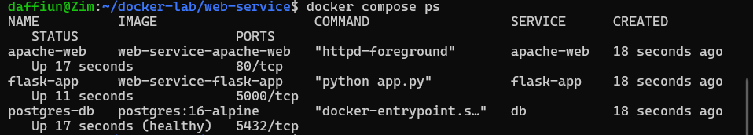
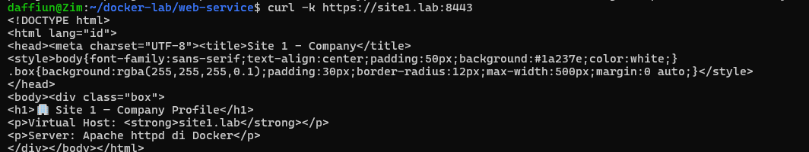
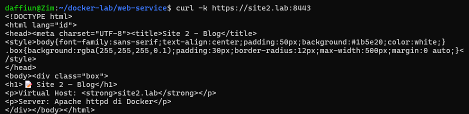
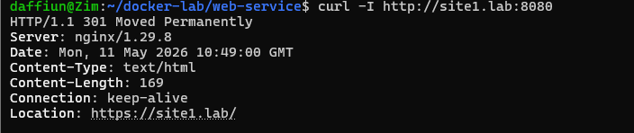
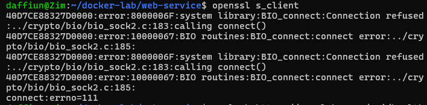
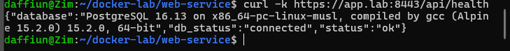
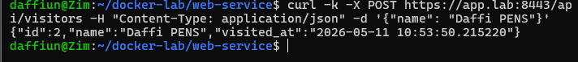
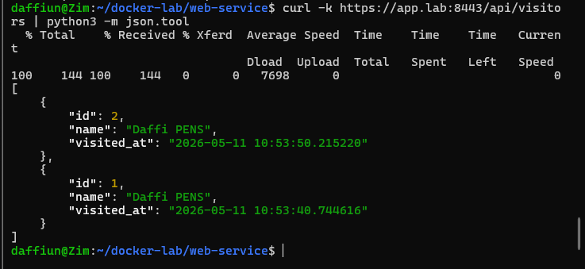
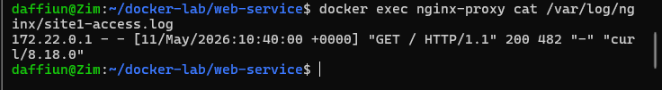
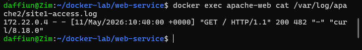

# Modul 3: Web Service Docker
1.  docker compose ps — 4 service running

2.  curl -k https://site1.lab:8443 — halaman Site 1

3.  curl -k https://site2.lab:8443 — halaman Site 2

4.  curl -I http://site1.lab:8080 — HTTP→HTTPS redirect 301

5.  openssl s_client output — detail certificate

6.  curl -k https://app.lab:8443/api/health — JSON database connected

7.  POST /api/visitors — response 201

8.  GET /api/visitors — daftar visitor

9.  Log Nginx per-site

10. Log Apache per-site

11. Post test

1.  Bandingkan response header dari Apache vs Nginx. Header apa yang menunjukkan software web server?

Header yang bertugas menunjukkan nama web server adalah header Server. Karena di praktikum ini Nginx ditaruh di barisan paling depan untuk menyambut pengunjung (sebagai proxy), maka kalau kita cek headernya dari luar pasti yang muncul adalah Server: nginx. Nginx ini menutupi Apache yang ada di belakangnya, sehingga nama Apache tidak akan terlihat dari luar kecuali kita mengakses Apachenya langsung dari dalam jaringan Docker.

2.  Jika Nginx proxy down, apakah Apache masih bisa diakses langsung? Bagaimana cara testnya?

Jika Nginx mati, Apache sama sekali tidak bisa diakses langsung dari browser atau komputer kita. Hal ini karena di pengaturan Docker, Apache tidak diberi "pintu" (port) yang menyambung langsung ke luar, sehingga dia benar-benar terkurung di dalam Docker. Cara mengetesnya gampang: cukup matikan Nginx dengan perintah docker stop nginx-proxy, lalu coba buka webnya lagi lewat browser atau curl; pasti koneksinya langsung ditolak atau error connection refused.

3.  Tunjukkan bahwa X-Real-IP header diteruskan dengan benar dari Nginx ke Flask.

Buktinya bisa langsung kita lihat waktu kita mengakses link aplikasi Flask-nya (yang app.lab). Di layar akan muncul tulisan berupa data JSON, dan kalau kita perhatikan di bagian "client_ip", isinya adalah alamat IP komputer kita sendiri, bukan IP milik Nginx. Ini membuktikan bahwa Nginx sudah berhasil "mengoper" informasi IP asli kita ke Flask lewat jalur khusus bernama X-Real-IP, sehingga Flask tahu persis siapa yang sedang mengakses aplikasinya.

4.  Jelaskan mengapa Flask app perlu terhubung ke dua network (web-net dan db-net).

Flask perlu nyambung ke dua jaringan ini supaya bisa jadi jembatan yang aman. Jaringan web-net dipakai biar Flask bisa terhubung ke Nginx untuk menerima kunjungan dari internet, sedangkan jaringan db-net dipakai khusus biar Flask bisa mengobrol dengan database PostgreSQL. Sengaja dipisah seperti ini agar orang luar (atau Web Server) tidak bisa langsung menyentuh database, jadi kalaupun Nginx atau Apache kebobolan peretas, databasenya tetap aman karena jalurnya terputus.

5.  Apa yang terjadi jika file server.key atau server.crt dihapus saat container running?

Kalau file sertifikatnya dihapus saat Nginx sedang berjalan, website kita ajaibnya akan tetap bisa diakses dengan aman seolah-olah tidak terjadi apa-apa. Ini terjadi karena Nginx sudah keburu "menghafal" isi sertifikat tersebut ke dalam RAM komputer saat pertama kali dinyalakan tadi. Tapi, website kita baru akan benar-benar rusak dan Nginx-nya error (crash) kalau kita mencoba me-restart container Nginx tersebut, karena dia akan mencoba mencari file itu lagi dan tidak bisa menemukannya.
