# Modul 4: Database PostgreSQL
1.  docker compose ps — db dan pgadmin running + healthy

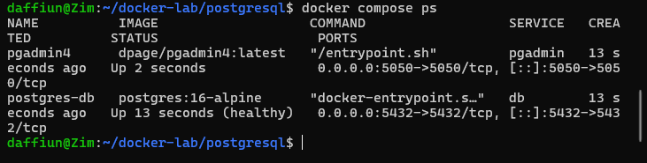

2.  psql connect + \dt app.\* — list tabel

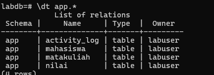

3.  SELECT \* FROM app.mahasiswa — data sample

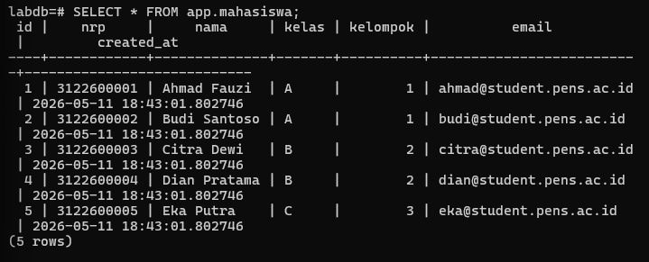

4.  Query JOIN nilai — output tabel gabungan

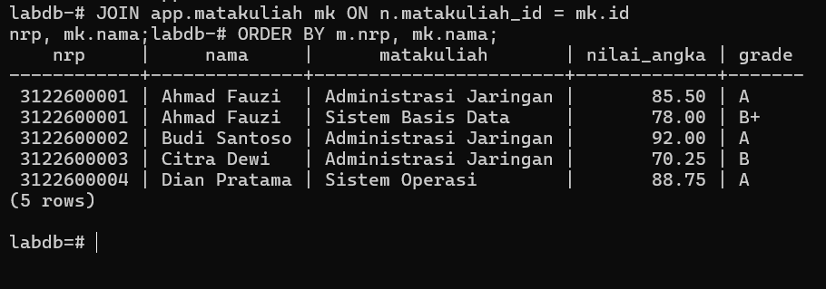

5.  pgAdmin4 login + server connection

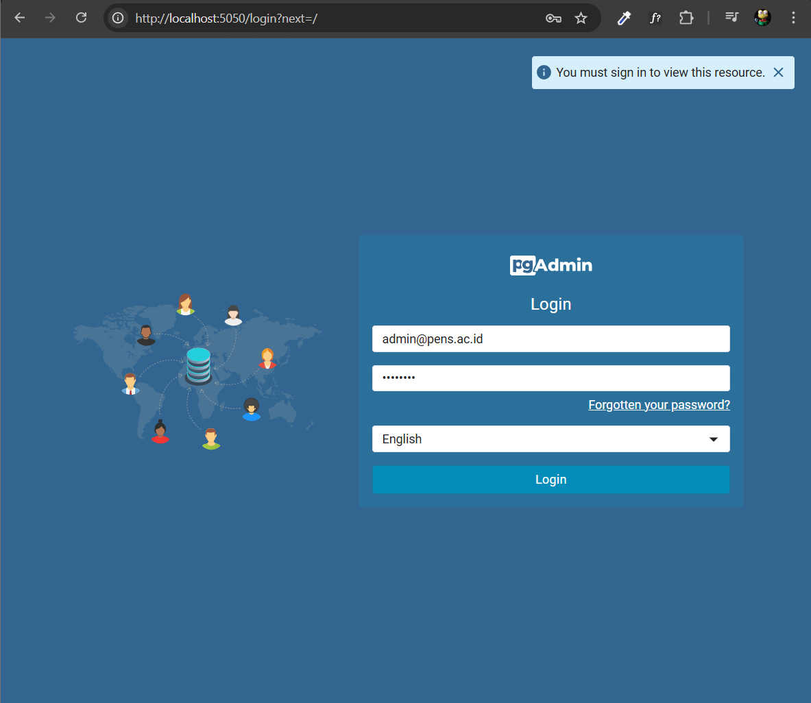

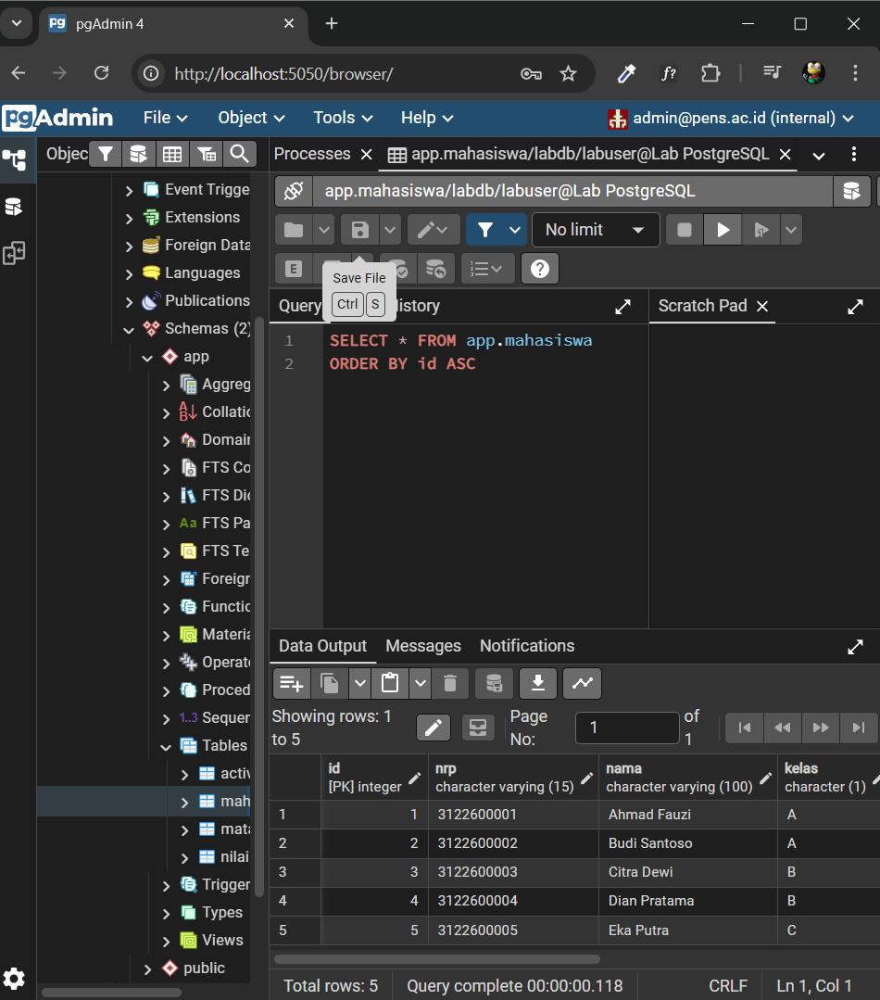

6.  pgAdmin4 — tabel view/edit data

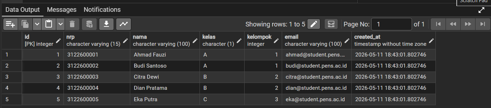

7.  pg_dump output — backup file terbuat

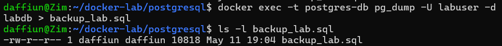

8.  pg_restore + SELECT — data berhasil di-restore

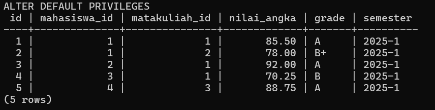

9.  pg_stat_activity — koneksi aktif

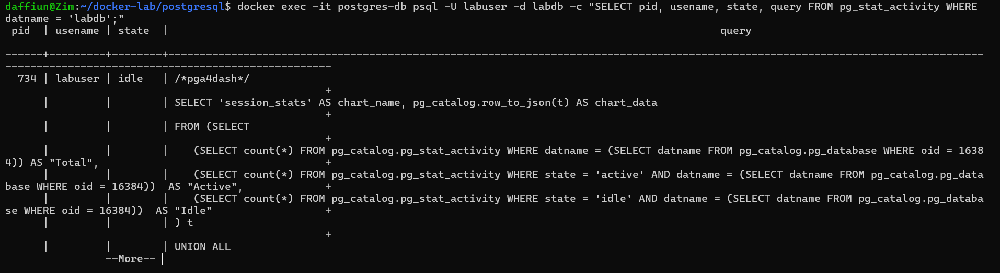

10. PostgreSQL log — isi log file

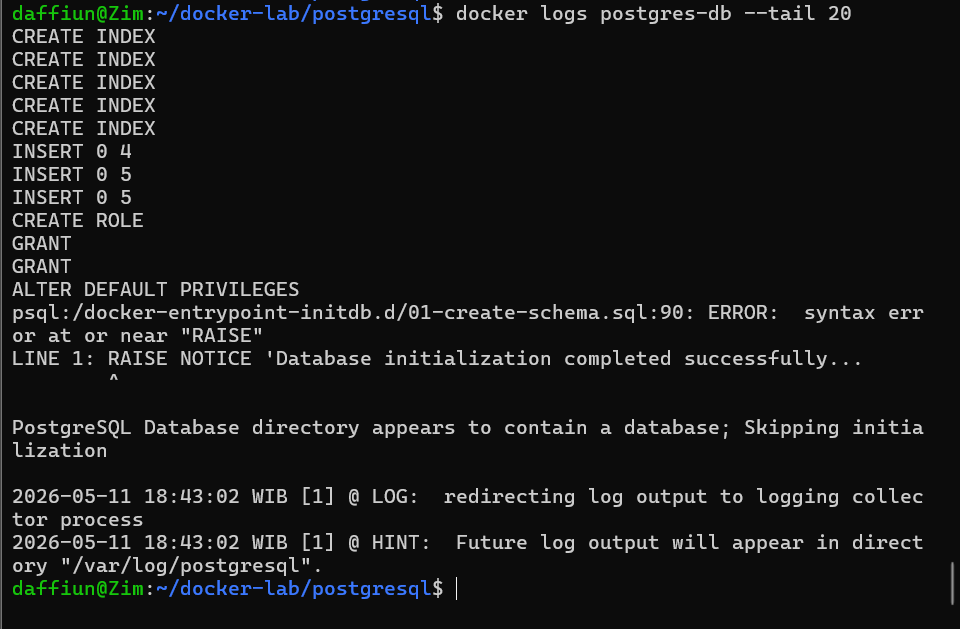

11. Post test

1.  Jalankan docker compose down lalu docker compose up -d. Apakah data mahasiswa masih ada? Buktikan.

Data mahasiswa masih ada dan tidak hilang karena perintah docker compose down hanya menghapus container dan network, sementara data fisik tetap tersimpan aman di dalam Docker Volume (pg-data). Hal ini dapat dibuktikan dengan menjalankan perintah docker exec -it postgres-db psql -U labuser -d labdb -c "SELECT COUNT(\*) FROM app.mahasiswa;" setelah container dinyalakan kembali, yang akan menunjukkan jumlah data yang tetap sama seperti sebelum container dihentikan.

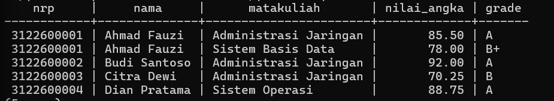

2.  Jalankan docker compose down -v lalu docker compose up -d. Apa yang terjadi? Apakah init script dijalankan ulang?

Saat menjalankan docker compose down -v, yang terjadi adalah Docker menghapus container sekaligus menghapus volume penyimpanan permanen, sehingga seluruh data mahasiswa yang telah diinput akan hilang total. Karena direktori data menjadi kosong, saat container dijalankan ulang dengan up -d, PostgreSQL akan menganggapnya sebagai instalasi baru dan otomatis menjalankan ulang init script (file .sql di folder init) untuk membangun kembali struktur database dari awal.

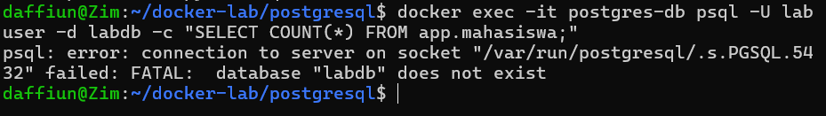

3.  Bandingkan ukuran file backup format custom vs SQL. Mana yang lebih kecil dan mengapa?

Format Custom lebih kecil dibandingkan format SQL karena format Custom menggunakan kompresi biner internal PostgreSQL yang memadatkan data, sedangkan format SQL berupa teks biasa (plain text) yang berisi deretan perintah SQL panjang tanpa kompresi. Selain ukurannya yang lebih hemat ruang, format Custom juga lebih unggul karena memungkinkan fleksibilitas saat pemulihan data menggunakan perintah pg_restore.

4.  Buat query yang menampilkan mahasiswa yang belum memiliki nilai di semester apapun.

Untuk menampilkan mahasiswa yang belum memiliki nilai, kamu bisa menggunakan query: SELECT m.nrp, m.nama FROM app.mahasiswa m LEFT JOIN app.nilai n ON m.id = n.mahasiswa_id WHERE n.id IS NULL;. Query ini bekerja dengan cara menggabungkan tabel mahasiswa dan nilai menggunakan LEFT JOIN, lalu menyaring baris di mana kolom ID pada tabel nilai bernilai NULL, yang menandakan mahasiswa tersebut tidak memiliki catatan nilai sama sekali di semester manapun.

5.  Jelaskan peran user app_reader yang dibuat di init script. Apa bedanya dengan labuser?

User app_reader berperan sebagai akun Read-Only yang hanya memiliki hak akses SELECT untuk membaca data, sehingga sangat aman digunakan oleh aplikasi pihak ketiga agar tidak bisa mengubah atau menghapus data secara tidak sengaja. Perbedaannya dengan labuser adalah labuser bertindak sebagai Owner atau Admin yang memiliki hak akses penuh (All Privileges), termasuk kemampuan untuk membuat skema, menambah tabel, hingga menghapus seluruh isi database.
