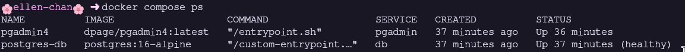
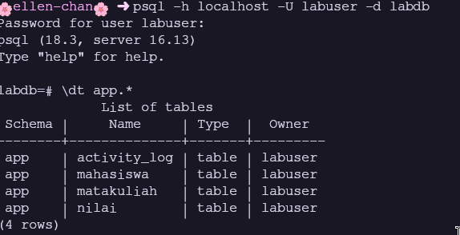
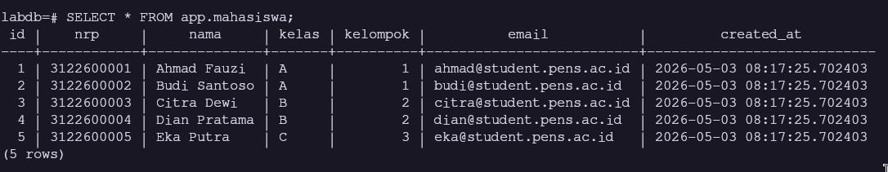
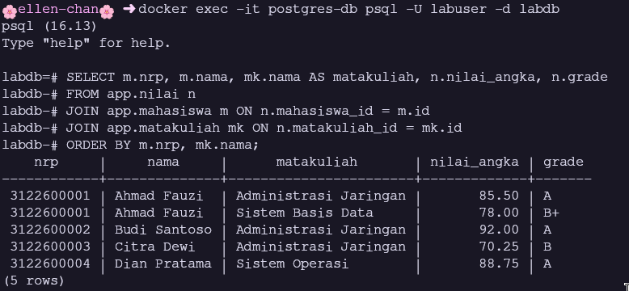
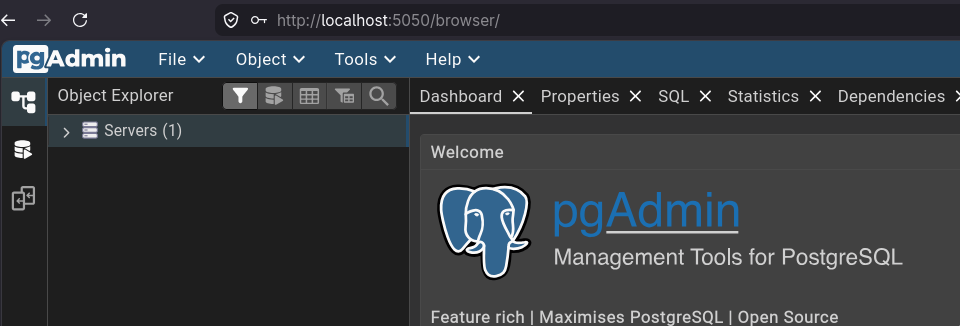
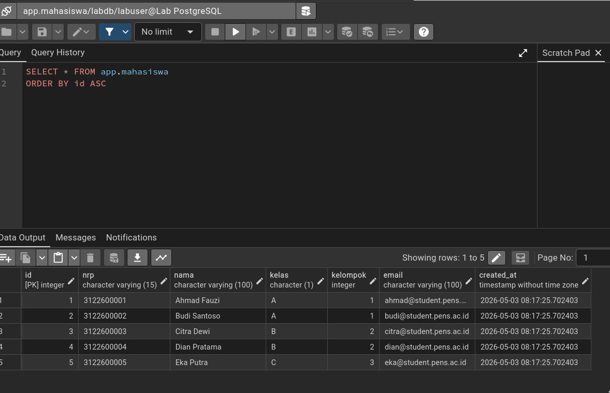
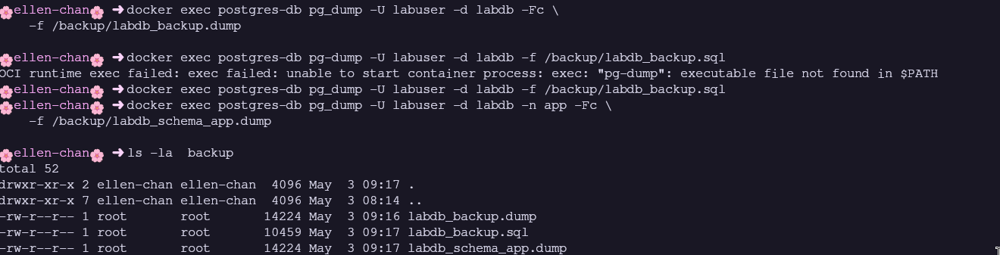
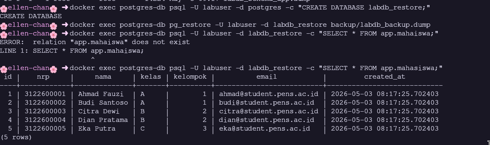
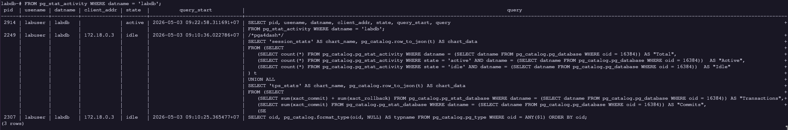
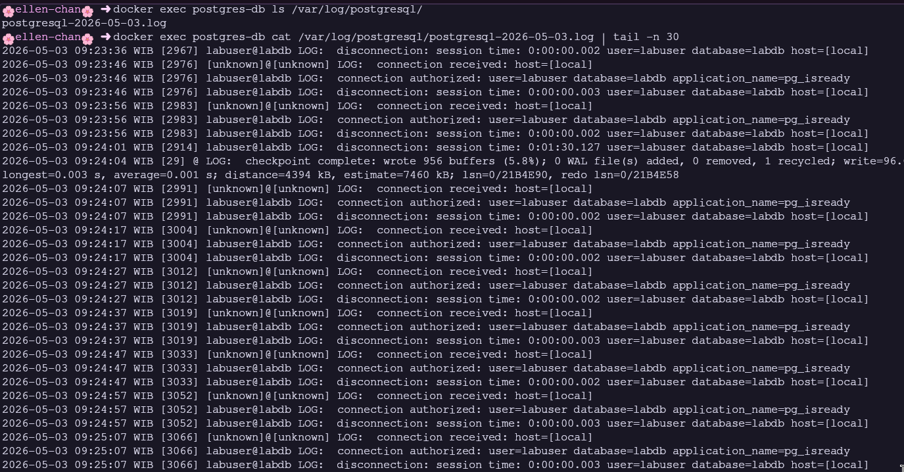

# Modul 4: Database Service di Docker - PostgreSQL

> **Nama:** Daffi Achmad Wijayanto

## Ringkasan Modul

Modul ini mengulas deployment PostgreSQL sebagai container Docker dengan konfigurasi produksi-grade. Praktikum mencakup inisialisasi otomatis via init script, persistent data dengan Volume, backup/restore (pg_dump/pg_restore), konfigurasi PostgreSQL (auth, tuning), pgAdmin 4 GUI, skema database relasional (mahasiswa, matakuliah, nilai, activity_log), dan monitoring via query statistik sistem.

## 4.1 Tujuan Pembelajaran dan Dasar Teori

Modul 4 disusun agar mahasiswa mampu: (1) Deploy PostgreSQL di container; (2) Inisialisasi database via init script; (3) Mengelola persistent data dengan Volume; (4) Backup dan restore database; (5) Konfigurasi PostgreSQL: auth dan tuning; (6) Menggunakan pgAdmin 4 GUI; (7) Membuat skema, tabel, index, query SQL; (8) Health check dan monitoring. Image postgres menyediakan /docker-entrypoint-initdb.d/ - file .sql/.sh dieksekusi otomatis hanya saat volume kosong (first-time init).

### Analisis Teknis

PostgreSQL: RDBMS open-source dengan ACID, JSON/JSONB, full-text search. Data Harus di Volume karena: container layer ephemeral; Volume memberikan I/O lebih baik (bypass union filesystem); bisa di-backup/restore/migrasi. Init script hanya jalan sekali - perubahan skema setelah running perlu migration manual. Custom config via volume mount memungkinkan tuning (shared_buffers, work_mem) untuk container resource terbatas.

## 4.2 Screenshot 1: docker compose ps - PostgreSQL dan pgAdmin

_Gambar pendukung bersumber dari halaman 27 laporan asli._

### Uraian Langkah

Stack: postgres-db (PostgreSQL 16 Alpine) dan pgadmin4 (GUI). Tangkapan layar menampilkan docker compose ps: kedua service Up, PostgreSQL healthy (pg_isready). pgAdmin menunggu database via depends_on condition: service_healthy.

### Analisis Teknis

PostgreSQL pakai konfigurasi kustom (custom-postgresql.conf): shared_buffers=128MB, work_mem=4MB, effective_cache_size=256MB. Logging: log_statement='mod', log_min_duration_statement=1s. pgAdmin koneksi ke hostname db (service name) bukan localhost. Port 5432 exposed ke host untuk psql client external. Container name postgres-db dan pgadmin4 memudahkan DNS resolution.

## 4.3 Screenshot 2: Koneksi psql dan Verifikasi Schema - dt app.*

_Gambar pendukung bersumber dari halaman 28 laporan asli._

### Uraian Langkah

psql client connect ke PostgreSQL. Tangkapan layar menampilkan dt app.*: daftar tabel di schema app - mahasiswa, matakuliah, nilai, activity_log. Bukti init script berhasil dieksekusi.

### Analisis Teknis

Init script membuat: mahasiswa (UNIQUE nrp, CHECK kelas, CHECK kelompok), matakuliah (CHECK sks 1-6), nilai (FK ke mahasiswa dan matakuliah, composite UNIQUE), activity_log (BIGSERIAL, JSONB metadata). Index: idx_mahasiswa_kelas, idx_mahasiswa_nrp, idx_nilai_semester, idx_activity_log_timestamp dan GIN index. User app_reader dengan SELECT-only privilege. Database inventory_db tambahan.

## 4.4 Screenshot 3: SELECT * FROM app.mahasiswa - Data Sample

_Gambar pendukung bersumber dari halaman 29 laporan asli._

### Uraian Langkah

Query SELECT menampilkan data sample dari init script. Tangkapan layar menampilkan 5 mahasiswa: Ahmad Fauzi (A, kel.1), Budi Santoso (A, kel.1), Citra Dewi (B, kel.2), Dian Pratama (B, kel.2), Eka Putra (C, kel.3).

### Analisis Teknis

Data sample: NRP format 312260000X, kelas A/B/C/D via CHECK, kelompok 1-10, email @student.pens.ac.id, created_at via DEFAULT CURRENT_TIMESTAMP. 5 mahasiswa terdistribusi di kelas A, B, C (tidak ada D). Data ini menjadi dasar operasi CRUD dan JOIN. Variasi kelas dan kelompok memungkinkan query analitis (grouping by kelas, menghitung rata-rata per kelompok, dll).

## 4.5 Screenshot 4: Query JOIN - Nilai Mahasiswa per Matakuliah

_Gambar pendukung bersumber dari halaman 29 laporan asli._

### Uraian Langkah

Query JOIN tiga tabel: mahasiswa, nilai, matakuliah. Tangkapan layar menampilkan NRP, nama, matakuliah, nilai_angka, grade. Contoh: Ahmad Fauzi - Administrasi Jaringan: 85.50 (A), Sistem Basis Data: 78.00 (B+).

### Analisis Teknis

Many-to-many relationship via junction table nilai. Sample: Ahmad Fauzi ambil 2 matakuliah, Budi ambil 1, Citra ambil 1, Dian ambil 1, Eka tidak punya nilai. Variasi nilai 70.25-92.00 dengan grade A, B+, B. ORDER BY nrp, matakuliah. Query JOIN adalah fundamental operasi RDBMS untuk laporan akademik. Nilai bisa dianalisis: rata-rata per matakuliah, distribusi grade, mahasiswa tanpa nilai.

## 4.6 Screenshot 5: pgAdmin 4 - Login dan Server Connection

_Gambar pendukung bersumber dari halaman 30 laporan asli._

### Uraian Langkah

pgAdmin 4 diakses di `http://localhost:5050`. Tangkapan layar menampilkan login dengan admin@pens.ac.id / admin123, dan Add New Server: Name 'Lab PostgreSQL', Host 'db' (service name Docker), Port 5432, Database labdb, Username labuser.

### Analisis Teknis

pgAdmin 4: GUI management tool berbasis web. Kredensial via PGADMIN_DEFAULT_EMAIL dan PGADMIN_DEFAULT_PASSWORD. Perlu diperhatikan: Host diisi 'db' (service name Docker Compose), BUKAN 'localhost'. localhost = container pgAdmin sendiri (tidak ada PostgreSQL). Docker DNS resolve 'db' ke container postgres-db di network db-net. Setelah koneksi, navigasi hierarkis: Server -> Database -> Schema -> Table.

## 4.7 Screenshot 6: pgAdmin 4 - Tabel View/Edit Data Mahasiswa

_Gambar pendukung bersumber dari halaman 30 laporan asli._

### Uraian Langkah

Setelah koneksi berhasil, navigasi ke tabel mahasiswa. Tangkapan layar menampilkan data mahasiswa di pgAdmin via View/Edit Data -> All Rows. Tampilan grid dengan kolom id, nrp, nama, kelas, kelompok, email, created_at.

### Analisis Teknis

pgAdmin data editor: grid editable, sorting per kolom, filtering (Ctrl+F), export CSV, edit langsung. Tab SQL menampilkan query yang digunakan. Object browser kiri: hierarki database. Tool ini berguna untuk pengembangan, debugging data, dan presentasi. Untuk produksi: akses pgAdmin dibatasi via VPN atau IP whitelist karena memberikan akses penuh ke database.

## 4.8 Screenshot 7: Backup Database - pg_dump Custom dan SQL Format

_Gambar pendukung bersumber dari halaman 31 laporan asli._

### Uraian Langkah

Backup via pg_dump dari dalam container. Tangkapan layar menampilkan ls -la backup/: labdb_backup.dump (custom compressed, -Fc) dan labdb_backup.sql (plain text). Perbedaan ukuran file antara kedua format terlihat jelas.

### Analisis Teknis

Format custom (-Fc): compressed (zlib), restore fleksibel via pg_restore, bisa selective restore, parallel restore (-j). Format SQL: plain text, human-readable, bisa diedit, kompatibel lintas versi. File .dump lebih kecil karena kompresi. Backup via docker exec memastikan versi pg_dump sama dengan server. Untuk produksi: backup rutin (cron), retention policy, uji restore berkala, simpan di lokasi berbeda.

## 4.9 Screenshot 8: Restore Database - pg_restore dan Verifikasi

_Gambar pendukung bersumber dari halaman 31 laporan asli._

### Uraian Langkah

Database labdb_restore dibuat, di-restore dari backup. Tangkapan layar menampilkan SELECT * FROM app.mahasiswa di labdb_restore: 5 mahasiswa sama persis, membuktikan bahwa restore berhasil dan data lengkap.

### Analisis Teknis

Restore: CREATE DATABASE labdb_restore -> pg_restore -d labdb_restore /backup/labdb_backup.dump. Verifikasi SELECT membuktikan bahwa integritas backup. Backup tanpa uji restore bukanlah backup valid. Lingkungan produksi best practice: backup harian (retention 7-30 hari), WAL archiving (PITR), uji restore bulanan, offsite storage.

## 4.10 Screenshot 9: Monitoring - pg_stat_activity (Koneksi Aktif)

_Gambar pendukung bersumber dari halaman 32 laporan asli._

### Uraian Langkah

View pg_stat_activity menampilkan koneksi aktif ke database. Tangkapan layar menampilkan query dan output: PID, usename, datname, client_addr, state, query. Juga pg_database_size untuk monitoring penggunaan disk per database.

### Analisis Teknis

pg_stat_activity: setiap koneksi/session dengan info PID, user, database, client IP, state (active/idle/idle in transaction), query. Berguna untuk: deteksi long-running query, identifikasi idle connection boros resource, troubleshooting locking, capacity planning. pg_database_size dan pg_total_relation_size untuk monitoring disk usage. Monitoring rutin mencegah kehabisan disk dan mendeteksi query problematic.

## 4.11 Screenshot 10: PostgreSQL Log - /var/log/postgresql/

_Gambar pendukung bersumber dari halaman 33 laporan asli._

### Uraian Langkah

PostgreSQL log via logging_collector. Tangkapan layar menampilkan isi log postgresql-YYYY-MM-DD.log: koneksi, disconnections, query, error, checkpoint. Log disimpan di volume pg-logs.

### Analisis Teknis

Log config: logging_collector=on, log_directory='/var/log/postgresql', log_filename='postgresql-

## 4.12 Jawaban Post-Lab Modul 4 (Bagian 1)

Berikut jawaban dan pembahasan untuk pertanyaan post-lab Modul 4 nomor 1-3.

### Pembahasan Jawaban

1. docker compose down lalu up - data tetap ada. Bukti: SELECT * FROM app.mahasiswa masih menampilkan 5 mahasiswa. Alasan: docker compose down tanpa `-v` hanya hapus container dan network, tidak hapus volume pg-data. Container baru me-mount volume sama, PostgreSQL deteksi PGDATA valid, langsung gunakan data existing.
2. docker compose down -v lalu up - flag `-v` menghapus volume pg-data. Akibat: volume baru kosong, PostgreSQL deteksi PGDATA kosong -> initdb dari awal, init script dieksekusi ulang (schema, tabel, sample data dibuat ulang). Semua data setelah inisialisasi pertama hilang permanen. Harus hati-hati dengan flag `-v` di produksi.
3. Backup custom vs SQL: format custom (-Fc) lebih kecil (kompresi zlib). File SQL tulis INSERT sebagai teks lengkap (verbose). Custom lebih cepat restore (pg_restore parsing biner), dukung selective restore. SQL unggul portabilitas (bisa diedit, versi berbeda).

## 4.13 Jawaban Post-Lab Modul 4 (Bagian 2)

Berikut jawaban dan pembahasan untuk pertanyaan post-lab Modul 4 nomor 4-5.

### Pembahasan Jawaban

4. Query mahasiswa tanpa nilai: SELECT m.nrp, m.nama, m.kelas FROM app.mahasiswa m LEFT JOIN app.nilai n ON m.id = n.mahasiswa_id WHERE n.mahasiswa_id IS NULL; Alternatif NOT EXISTS: SELECT nrp, nama, kelas FROM app.mahasiswa m WHERE NOT EXISTS (SELECT 1 FROM app.nilai n WHERE n.mahasiswa_id = m.id); Dalam sample data, Eka Putra (3122600005) muncul karena tidak punya record nilai.
5. Peran app_reader vs labuser: app_reader: SELECT-only di schema app (GRANT USAGE + GRANT SELECT + ALTER DEFAULT PRIVILEGES). Hanya bisa MEMBACA. labuser: superuser database (bisa CREATE/DROP table, INSERT/UPDATE/DELETE, manage user). Implementasi least privilege: reporting service pakai app_reader (bocor -> hanya read), API write pakai user terbatas, admin pakai labuser. Membatasi blast radius jika kredensial bocor.
