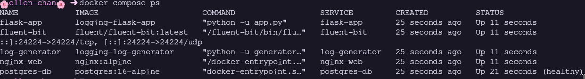
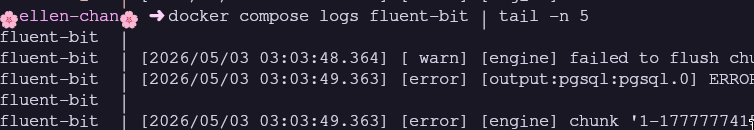
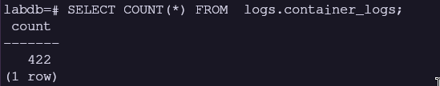
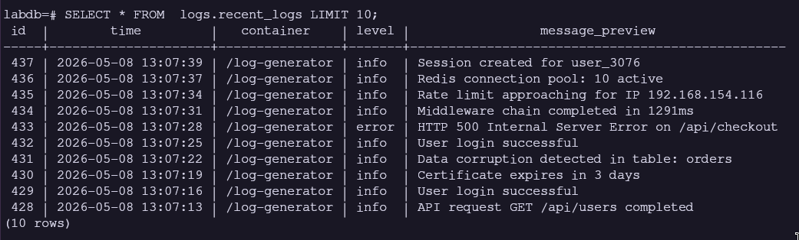
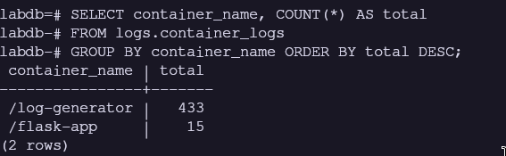
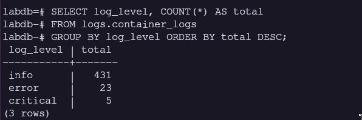
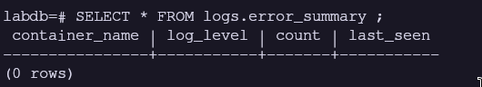
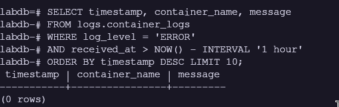
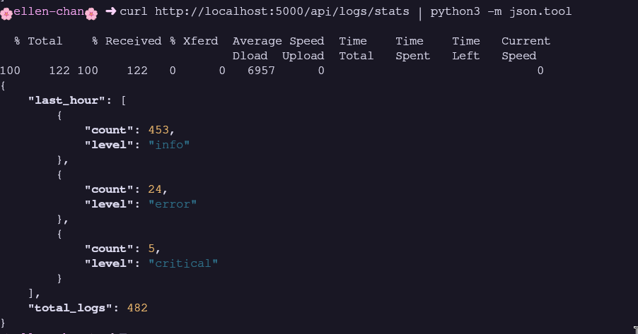
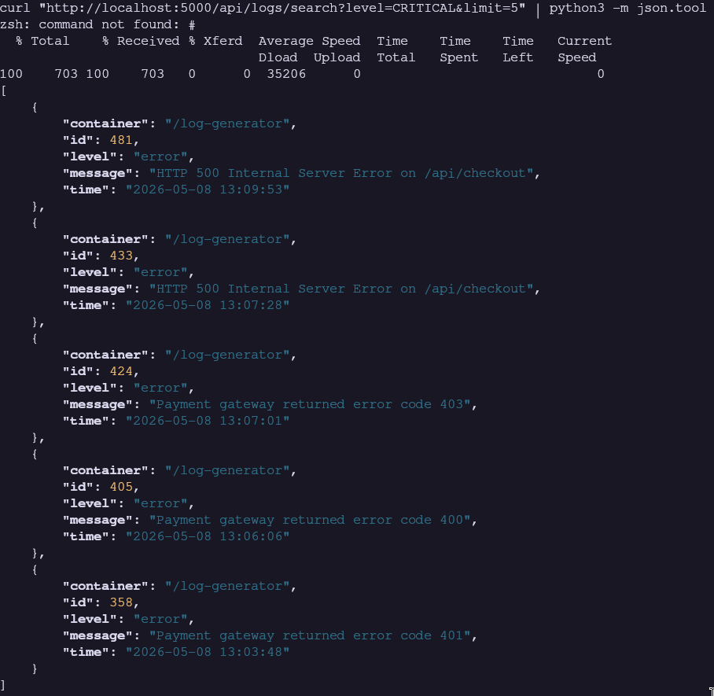

# Modul 5: Logging Service Docker dengan PostgreSQL

> **Nama:** Daffi Achmad Wijayanto

## Ringkasan Modul

Modul ini mengulas centralized logging di lingkungan container dengan Fluent Bit (log collector) dan PostgreSQL (log storage). Mahasiswa belajar konfigurasi Docker logging driver fluentd, Fluent Bit pipeline (input/filter/output), Python log generator multi-level, Flask API untuk query log, dan log retention policy. Stack terdiri dari 5 service: fluent-bit, postgres-db, nginx-web, flask-app, log-generator.

## 5.1 Tujuan Pembelajaran dan Dasar Teori

Modul 5 disusun agar mahasiswa mampu: (1) Memahami centralized logging di container; (2) Deploy Fluent Bit sebagai collector/forwarder; (3) Konfigurasi Docker logging driver fluentd; (4) Menyimpan log ke PostgreSQL terpusat; (5) Membuat Python log generator multi-level; (6) Query dan analisis log dengan SQL; (7) Implementasi log retention; (8) Orkestrasi stack logging dengan Docker Compose. Fluent Bit (C, 1MB RAM) vs Fluentd (Ruby, 40MB). Docker logging driver fluentd kirim stdout ke Fluent Bit tanpa file lokal.

### Analisis Teknis

Container ephemeral dan banyak -> log tersebar, sulit debugging. Centralized logging kumpulkan semua log ke satu tempat. Fluent Bit pipeline: INPUT (forward protocol :24224) -> FILTER (parser docker_json + modify rename) -> OUTPUT (pgsql ke PostgreSQL + stdout debugging). Keunggulan log di database vs file: query SQL terstruktur, agregasi (GROUP BY, date_trunc), integrasi tools, retention otomatis.

## 5.2 Screenshot 1: docker compose ps - 5 Service Running

_Gambar pendukung bersumber dari halaman 35 laporan asli._

### Uraian Langkah

Stack: fluent-bit, postgres-db, nginx-web, flask-app, log-generator. Tangkapan layar menampilkan docker compose ps: 5 service Up. Tiga producer (nginx, flask, generator) kirim log ke fluent-bit via driver fluentd, diteruskan ke PostgreSQL.

### Analisis Teknis

Arsitektur: log producer (fluentd driver, localhost:24224) -> Fluent Bit (collector) -> PostgreSQL (storage). Schema logs: container_logs, hourly_summary, view recent_logs dan error_summary, fungsi cleanup. Flask API: /api/logs/stats dan /api/logs/search. Network logging-net tunggal. depends_on memastikan startup order: postgres-db -> fluent-bit -> producer.

## 5.3 Screenshot 2: Fluent Bit Log - Menerima dan Memproses Log

_Gambar pendukung bersumber dari halaman 36 laporan asli._

### Uraian Langkah

docker compose logs fluent-bit menampilkan Fluent Bit menerima log real-time. Tangkapan layar menampilkan JSON lines: timestamp, container_name, container_id, source (stdout/stderr), log content. Fluent Bit memproses dan menyimpan ke PostgreSQL.

### Analisis Teknis

Pipeline processing: INPUT forward terima dari Docker driver -> FILTER parser (docker_json) parse field log -> FILTER modify rename (log->message, container_name->source_container) -> OUTPUT pgsql INSERT ke logs.container_logs -> OUTPUT stdout display untuk debugging. Connection pooling (min 1, max 4). Log format JSON memudahkan debugging pipeline. Log level 'info' cukup untuk monitoring.

## 5.4 Screenshot 3: SELECT COUNT(*) - Total Log Terkumpul

_Gambar pendukung bersumber dari halaman 36 laporan asli._

### Uraian Langkah

Verifikasi log masuk ke PostgreSQL: SELECT COUNT(*) FROM logs.container_logs. Tangkapan layar menampilkan total log yang berhasil dikumpulkan. Angka terus bertambah seiring generator dan traffic.

### Analisis Teknis

COUNT query indikator paling sederhana pipeline berfungsi sebagaimana mestinya. COUNT=0 artinya ada masalah (Fluent Bit tidak connect, driver tidak kirim, filter salah). Dengan LOG_INTERVAL=3, generator 20 log/menit + nginx 2-5 + flask 1-3 = total 25-30 log/menit. Setelah 5 menit, COUNT >100. Monitoring COUNT: penurunan drastis = masalah pipeline.

## 5.5 Screenshot 4: logs.recent_logs - 10 Log Terbaru

_Gambar pendukung bersumber dari halaman 37 laporan asli._

### Uraian Langkah

View recent_logs format log readable. Tangkapan layar menampilkan 10 log terbaru: time (formatted), container, level, message_preview (200 char). Data urut timestamp DESC. Log dari berbagai level (INFO, DEBUG, WARN, ERROR, CRITICAL).

### Analisis Teknis

recent_logs view: to_char formatting, LEFT(message, 200) preview, ORDER BY timestamp DESC LIMIT 100. Log generator mendominasi dengan variasi level dan pesan acak. Setiap log punya container_name (log-generator, nginx-web, flask-app). View ini untuk quick inspection tanpa query kompleks. Pesan bervariasi: user login, slow query, database connection error, out of memory, dll.

## 5.6 Screenshot 5: Distribusi Log per Container

_Gambar pendukung bersumber dari halaman 37 laporan asli._

### Uraian Langkah

GROUP BY container_name menampilkan distribusi log per sumber. Tangkapan layar menampilkan: log-generator ( 80

### Analisis Teknis

log-generator dominan (log setiap 3 detik), flask-app dan nginx-web lebih sedikit (hanya saat request). Analisis distribusi untuk: capacity planning (storage growth per container), identifikasi anomali (container tiba-tiba spike log), cost allocation (resource logging per service). Pola normal: generator terbanyak karena didesain untuk menghasilkan log kontinu.

## 5.7 Screenshot 6: Distribusi Log per Level

_Gambar pendukung bersumber dari halaman 38 laporan asli._

### Uraian Langkah

GROUP BY log_level menampilkan distribusi severity. Tangkapan layar menampilkan: INFO ( 50

### Analisis Teknis

Bobot generator: INFO=50, DEBUG=20, WARN=15, ERROR=10, CRITICAL=5 (total 100). Mensimulasikan produksi: mayoritas INFO, error jarang tapi penting. Analisis: (a) validasi semua level muncul; (b) monitor tren - lonjakan ERROR indikasi masalah; (c) alert threshold berdasarkan baseline. View error_summary (berikutnya) fokus pada level yang perlu tindakan.

## 5.8 Screenshot 7: logs.error_summary - Ringkasan Error per Container

_Gambar pendukung bersumber dari halaman 38 laporan asli._

### Uraian Langkah

View error_summary: ERROR, WARN, CRITICAL per container. Tangkapan layar menampilkan container_name, log_level, count, last_seen. Dashboard cepat identifikasi container bermasalah.

### Analisis Teknis

Query: WHERE log_level IN ('ERROR', 'WARN', 'CRITICAL') GROUP BY container_name, log_level ORDER BY count DESC. log-generator error terbanyak (sesuai bobot). last_seen penting: error masih ongoing atau sudah selesai. View ini ideal untuk on-call dashboard - langsung tampilkan gambaran kesehatan sistem. Spike ERROR -> investigasi segera.

## 5.9 Screenshot 8: Log Rate per Menit - date_trunc

_Gambar pendukung bersumber dari halaman 39 laporan asli._

### Uraian Langkah

date_trunc('minute', received_at) mengelompokkan log per menit. Tangkapan layar menampilkan minute dan logs_per_minute dalam 5 menit terakhir. Throughput 25-30 log/menit pada interval 3 detik.

### Analisis Teknis

Time-series aggregation: GROUP BY date_trunc('minute', received_at). Rate 25-30 log/menit dengan LOG_INTERVAL=3. Monitoring rate untuk: deteksi log storm (lonjakan drastis), memastikan pipeline tidak bottleneck, capacity planning storage (rate x avg_size x retention_days), menentukan apakah log sampling diperlukan. date_trunc adalah fungsi PostgreSQL powerful untuk time-series.

## 5.10 Screenshot 9: API Query - /api/logs/stats (JSON Response)

_Gambar pendukung bersumber dari halaman 39 laporan asli._

### Uraian Langkah

Flask API /api/logs/stats via curl. Tangkapan layar menampilkan JSON: total_logs (total seluruh log), last_hour (array distribusi per level dalam 1 jam terakhir). Interface HTTP untuk monitoring tanpa akses database langsung.

### Analisis Teknis

total_logs: COUNT(*) FROM logs.container_logs. last_hour: GROUP BY log_level WHERE received_at > NOW() - INTERVAL '1 hour'. Response JSON mudah integrasi dengan dashboard (Grafana, custom UI). API didesain untuk dipanggil periodik oleh monitoring system. Flask query PostgreSQL via psycopg2, format hasil sebagai JSON.

## 5.11 Screenshot 10: API Search - /api/logs/search?q=error&limit=5

_Gambar pendukung bersumber dari halaman 40 laporan asli._

### Uraian Langkah

API search via curl dengan parameter q=error dan limit=5. Tangkapan layar menampilkan JSON array: log entries mengandung 'error' di message. Informasi: id, time, container, level, message.

### Analisis Teknis

Search: ILIKE '

## 5.12 Jawaban Post-Lab Modul 5 (Bagian 1)

Berikut jawaban dan pembahasan untuk pertanyaan post-lab Modul 5 nomor 1-3.

### Pembahasan Jawaban

1. Total log setelah 5 menit: Dengan LOG_INTERVAL=3, generator 100 log, nginx 10-15, flask 5-10, total 115-125 log. Distribusi container: generator 80
2. Query log rate 10 menit: SELECT date_trunc('minute', received_at) AS minute, COUNT(*) AS logs_per_minute FROM logs.container_logs WHERE received_at > NOW() - INTERVAL '10 minutes' GROUP BY minute ORDER BY minute; Time-series throughput per menit. Berguna: deteksi anomali, kapasitas planning, identifikasi jam sibuk.
3. Fluent Bit di-stop: (a) Container producer tetap berjalan; (b) Log menumpuk di buffer Docker driver (terbatas); (c) Log di PostgreSQL tetap aman; (d) Log setelah Fluent Bit down HILANG (fluentd driver tanpa persistent buffer); (e) Fluent Bit start lagi -> log baru mengalir. Lingkungan produksi: gunakan message queue (Kafka) atau Fluent Bit disk buffering.

## 5.13 Jawaban Post-Lab Modul 5 (Bagian 2)

Berikut jawaban dan pembahasan untuk pertanyaan post-lab Modul 5 nomor 4-5.

### Pembahasan Jawaban

4. Alur log: (a) Python generator hasilkan JSON via print(flush=True) ke stdout; (b) Docker fluentd driver tangkap stdout, kirim ke Fluent Bit TCP localhost:24224 (timestamp, container_name, container_id, source, log); (c) Fluent Bit INPUT forward terima; (d) FILTER parser (docker_json) parse field log (JSON string) jadi structured; (e) FILTER modify rename field; (f) OUTPUT pgsql INSERT ke logs.container_logs; (g) Data siap di-query via SQL/API. Keunggulan: structured JSON memudahkan parsing, centralized storage, pipeline extensible (Elasticsearch, S3).
5. LOG_INTERVAL=0.5: 2 log/detik x 60 = 120 log/menit (generator saja). Total 125-130/menit - 6x lebih banyak. Dampak: volume data 6x lebih cepat, tabel bisa jutaan row dalam hitungan jam, query lambat tanpa index tepat, storage cepat penuh tanpa retention. Solusi: logs.cleanup_old_logs() periodik, table partitioning by date, atau output lebih scalable (S3/Kafka) untuk high-throughput produksi.
