# Modul 5: Logging Service
1.  docker compose ps — 5 service running

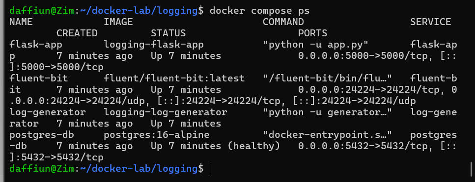

2.  docker compose logs fluent-bit — Fluent Bit menerima log

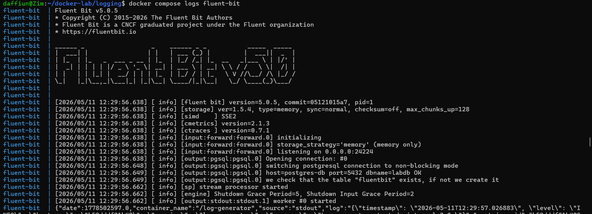

3.  SELECT COUNT(\*) FROM logs.container_logs — jumlah total log

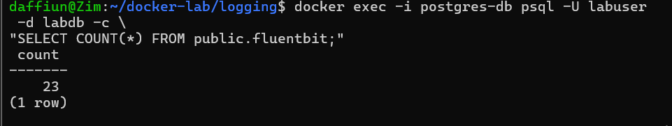

4.  SELECT \* FROM logs.recent_logs LIMIT 10 — sample log terbaru

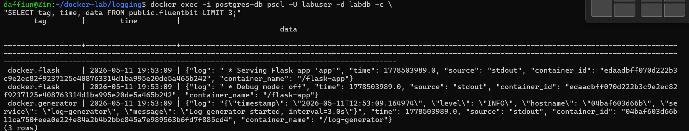

5.  Query distribusi per container — output tabel

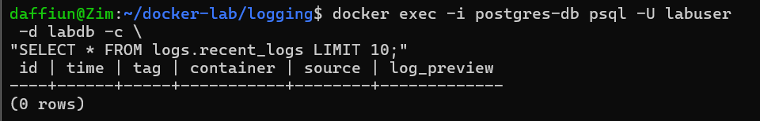

6.  Query distribusi per level — output tabel

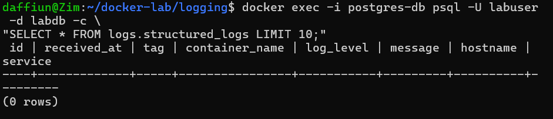

7.  SELECT \* FROM logs.error_summary — summary error

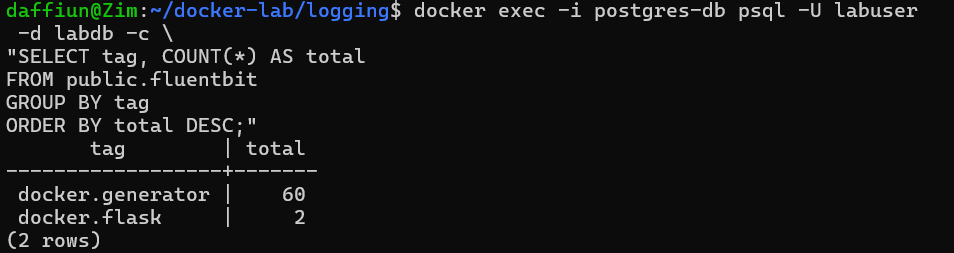

8.  Query log rate per menit — output tabel

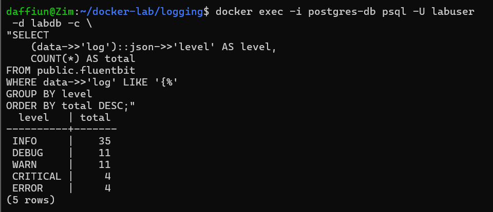

9.  curl /api/logs/stats — response JSON

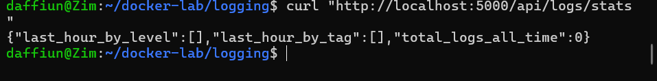

10. curl /api/logs/search?q=error — response JSON

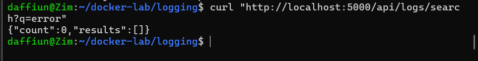

11. Post Test

1.  docker compose ps — 5 service running

Perintah ini digunakan untuk memastikan seluruh service pada stack Docker Compose sudah berjalan. Output harus menampilkan 5 container utama, yaitu postgres-db, fluent-bit, nginx-web, flask-app, dan log-generator. Jika semua statusnya Up, berarti environment praktikum berhasil dijalankan.

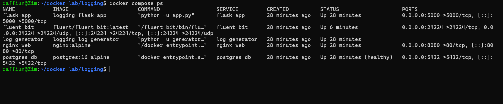

2.  docker compose logs fluent-bit — Fluent Bit menerima log (JSON lines di stdout)

Perintah ini digunakan untuk melihat log dari container Fluent Bit. Output JSON lines menunjukkan bahwa Fluent Bit berhasil menerima log dari container lain melalui Docker logging driver fluentd. Ini membuktikan bahwa proses pengumpulan log dari producer menuju collector sudah berjalan.

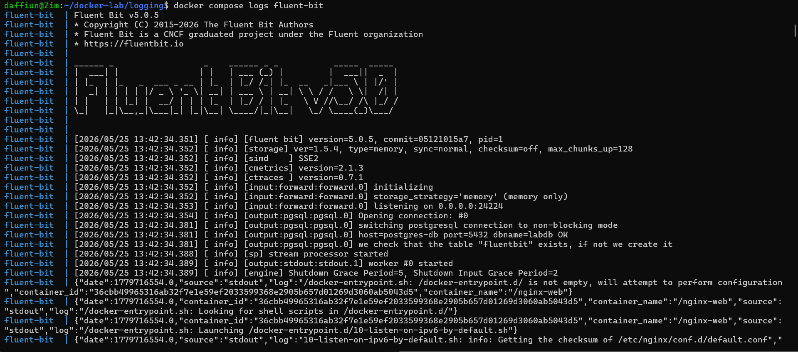

3.  SELECT COUNT(\*) FROM logs.fluentbit — jumlah total log \> 0

Query ini digunakan untuk menghitung total log yang sudah tersimpan di PostgreSQL. Jika hasilnya lebih dari 0, berarti Fluent Bit berhasil mengirim log ke database dan PostgreSQL berhasil menyimpannya di tabel logs.fluentbit.

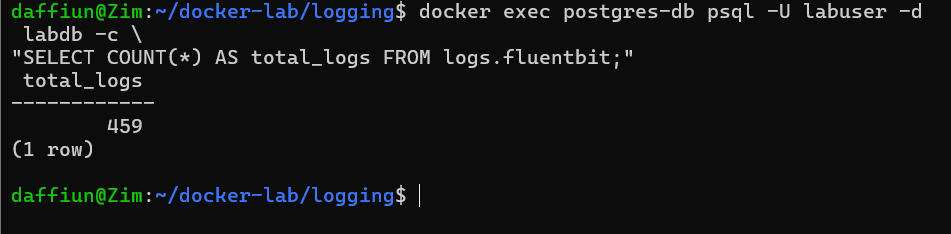

4.  SELECT tag, time, data FROM logs.fluentbit LIMIT 3 — raw 3-kolom data

Query ini menampilkan bentuk asli data log yang tersimpan di PostgreSQL. Kolom tag menunjukkan sumber log, kolom time menunjukkan waktu log diterima, dan kolom data berisi detail log dalam format JSONB seperti nama container, isi log, dan sumber output.

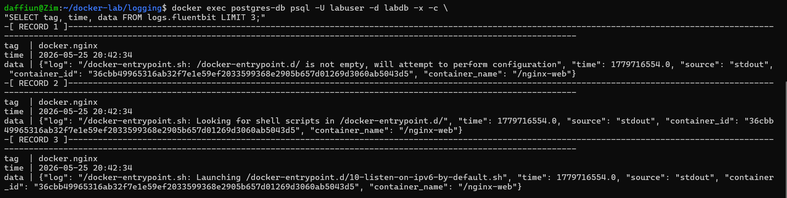

5.  SELECT \* FROM logs.recent_logs LIMIT 10 — log terbaru via view

Query ini mengambil 10 log terbaru melalui view logs.recent_logs. View ini memudahkan pembacaan log karena data JSONB sudah diringkas menjadi kolom seperti waktu, tag, container, source, dan preview isi log.

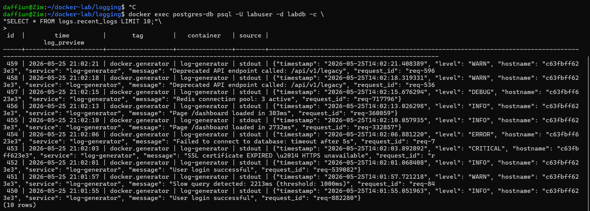

6.  SELECT \* FROM logs.structured_logs LIMIT 10 — parsed JSON log

Query ini menampilkan log yang memiliki format JSON terstruktur. View ini cocok untuk log dari flask-app dan log-generator karena field seperti log_level, message, hostname, dan service bisa diekstrak dari JSONB.

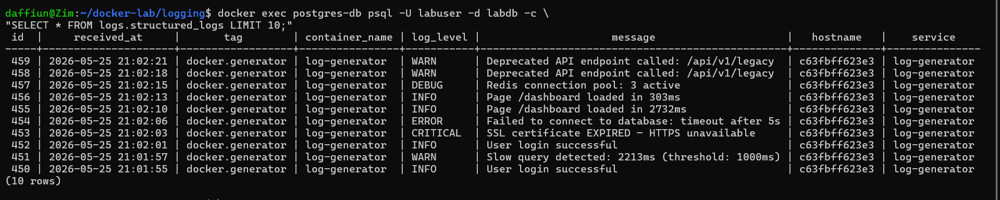

7.  Query distribusi per tag — output tabel

Query ini digunakan untuk menghitung jumlah log berdasarkan tag sumbernya, misalnya docker.nginx, docker.flask, dan docker.generator. Hasil query menunjukkan container atau service mana yang paling banyak menghasilkan log.

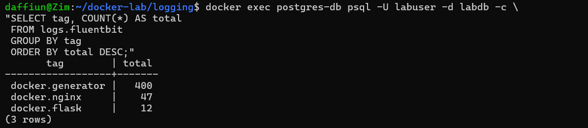

8.  Query distribusi per level — output tabel

Query ini digunakan untuk menghitung jumlah log berdasarkan level severity seperti INFO, DEBUG, WARN, ERROR, dan CRITICAL. Query ini hanya berlaku untuk structured log karena level log harus diekstrak dari data JSON.

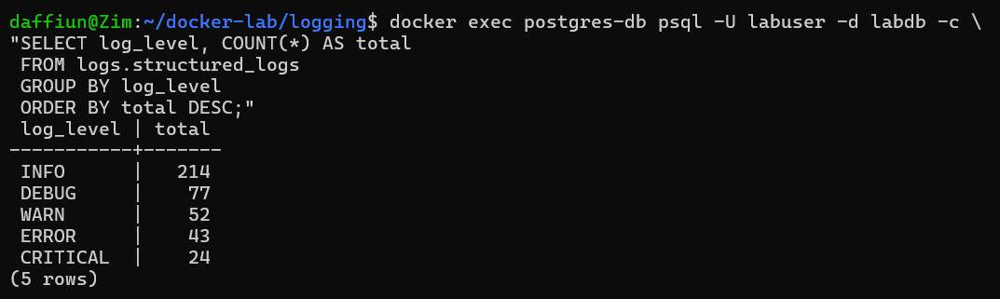

9.  SELECT \* FROM logs.error_summary — summary error

Query ini menampilkan ringkasan log bermasalah seperti WARN, ERROR, dan CRITICAL berdasarkan container. Hasilnya membantu melihat container mana yang paling sering menghasilkan error atau warning serta kapan terakhir masalah tersebut muncul.

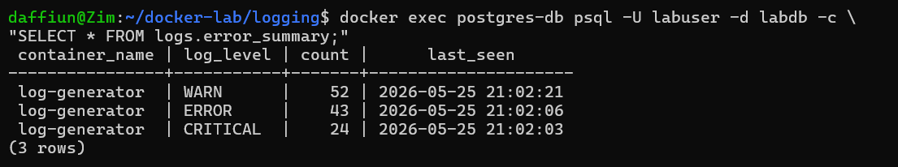

10. Query log rate per menit — output tabel

Query ini menghitung jumlah log yang masuk setiap menit dalam 10 menit terakhir. Hasilnya digunakan untuk melihat intensitas atau laju log dari waktu ke waktu, sehingga bisa diketahui apakah ada lonjakan aktivitas log.

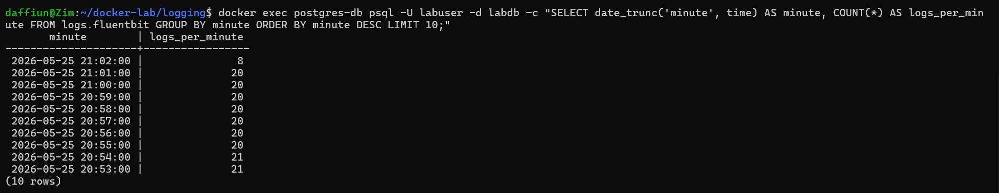

11. curl /api/logs/stats — response JSON

Perintah ini mengakses endpoint Flask API untuk mengambil statistik log dari PostgreSQL. Response JSON menunjukkan bahwa aplikasi Flask dapat membaca data log dari database dan menyajikannya melalui HTTP API.

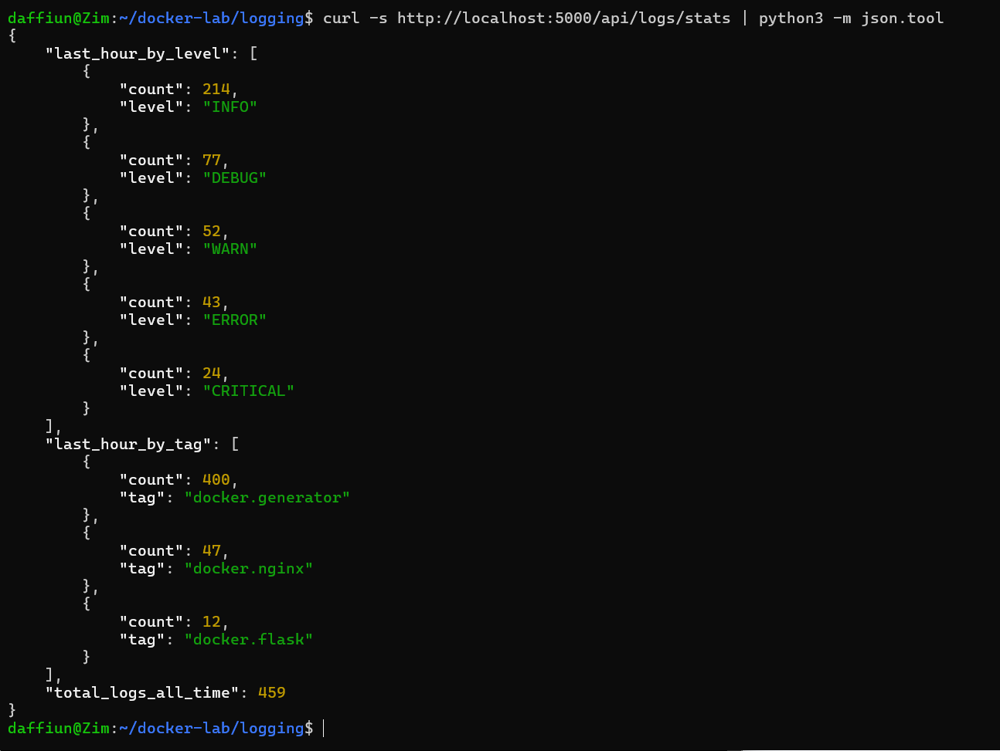

12. curl /api/logs/search?q=error — response JSON

Perintah ini digunakan untuk mencari log yang mengandung kata kunci error melalui Flask API. Hasilnya membuktikan bahwa log tidak hanya bisa dianalisis langsung lewat SQL, tetapi juga bisa dicari melalui endpoint aplikasi.

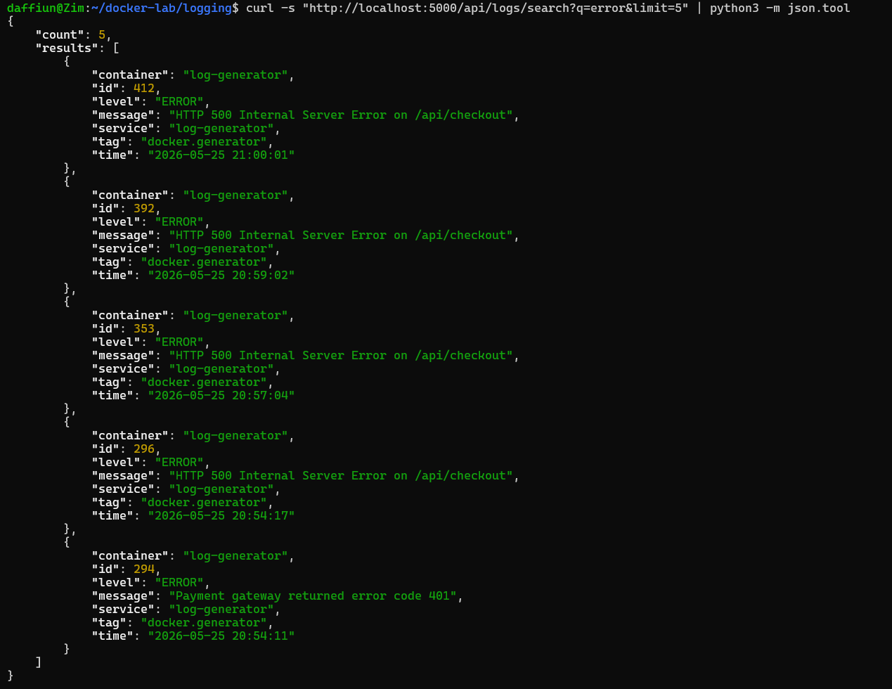
