# Modul 6: Grafana Service Docker untuk Monitoring Resource

> **Nama:** Daffi Achmad Wijayanto

## Ringkasan Modul

Modul ini mengulas deployment Grafana, Prometheus, Node Exporter, dan cAdvisor untuk Monitoring Infrastructure Container Resource. Praktikum mencakup arsitektur monitoring berbasis Prometheus + Grafana, deployment eksportir, pembuatan dan kustomisasi dashboard Grafana, integrasi log dari PostgreSQL, serta orkestrasi seluruh monitoring stack dengan Docker Compose.

## 6.1 Screenshot 1: docker compose ps - 9 Service Running

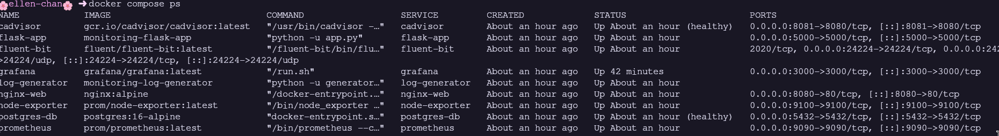

_Gambar pendukung bersumber dari halaman 42 laporan asli._

### Uraian Langkah

Output dari perintah docker compose ps yang menampilkan 9 service berjalan, yaitu prometheus, node-exporter, cadvisor, grafana, fluent-bit, postgres-db, nginx-web, flask-app, dan log-generator.

### Analisis Teknis

Menunjukkan bahwa seluruh orkestrasi stack monitoring dan logging berjalan dengan baik. Setiap service memiliki port dan network yang sesuai, serta status 'Up'.

## 6.2 Screenshot 2: Prometheus Targets - Semua Status UP

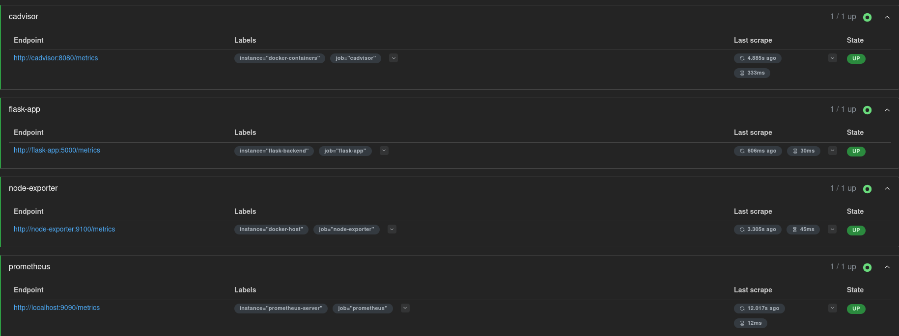

_Gambar pendukung bersumber dari halaman 43 laporan asli._

### Uraian Langkah

Tampilan halaman Targets pada dashboard Prometheus yang menampilkan semua target terpantau.

### Analisis Teknis

Memastikan bahwa Prometheus berhasil melakukan scrape metrik dari endpoint yang dikonfigurasi (node-exporter, cadvisor, flask-app, dan prometheus itu sendiri) secara berkala dan semuanya berstatus 'UP'.

## 6.3 Screenshot 3: Prometheus Query Browser - PromQL CPU Usage

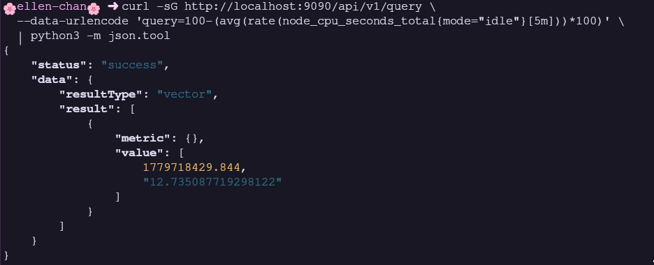

_Gambar pendukung bersumber dari halaman 43 laporan asli._

### Uraian Langkah

Tampilan eksekusi query PromQL untuk menghitung persentase penggunaan CPU (100 - (avg(rate(node_cpu_seconds_total{mode='idle'}[5m])) * 100)) pada antarmuka Prometheus.

### Analisis Teknis

Membuktikan fungsionalitas query PromQL berjalan dengan baik dengan mengekstrak data dari time-series database. Query tersebut menghitung sisa dari idle time CPU untuk mendapatkan active CPU usage.

## 6.4 Screenshot 4: Flask Prometheus Metrics - curl localhost:5000/metrics

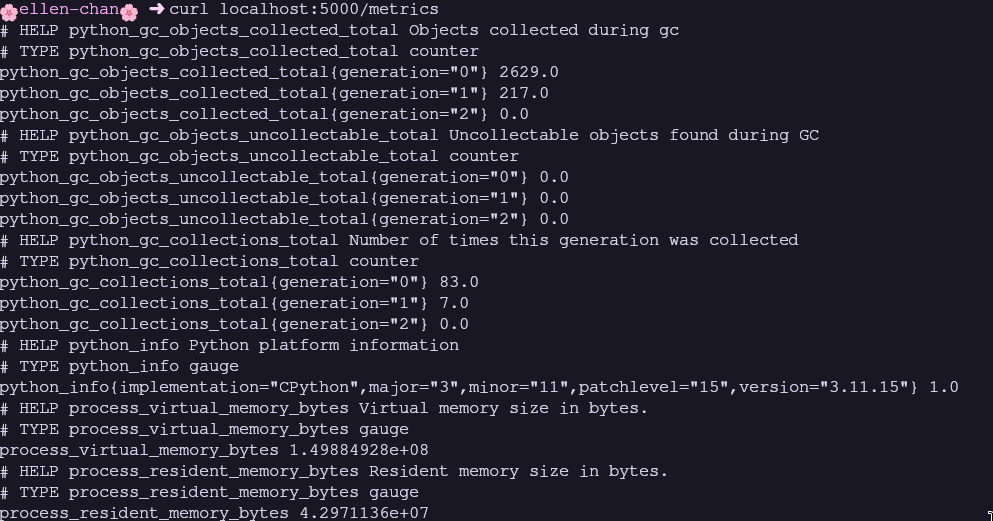

_Gambar pendukung bersumber dari halaman 44 laporan asli._

### Uraian Langkah

Output curl ke endpoint /metrics pada Flask app yang menampilkan custom metrics (seperti flask_http_requests_total).

### Analisis Teknis

Membuktikan bahwa metrik khusus aplikasi (seperti hitungan request HTTP dan latensinya) telah di-expose oleh Prometheus client di Flask dan siap di-scrape oleh Prometheus.

## 6.5 Screenshot 5: Grafana Login - Halaman Utama

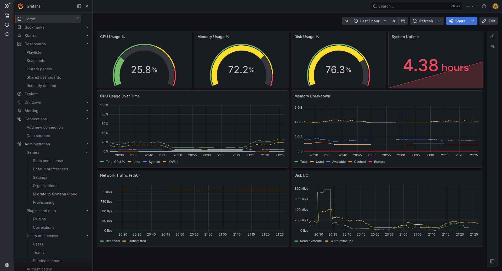

_Gambar pendukung bersumber dari halaman 44 laporan asli._

### Uraian Langkah

Halaman utama Grafana setelah proses login berhasil dilakukan.

### Analisis Teknis

Grafana telah di-deploy dan dapat diakses dengan kredensial administrator, menampilkan kesiapan platform visualisasi untuk menampilkan data metrik dan log.

## 6.6 Screenshot 6: Data Sources - Prometheus dan PostgreSQL

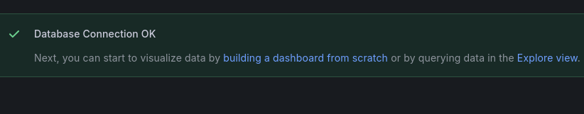

_Gambar pendukung bersumber dari halaman 45 laporan asli._

### Uraian Langkah

Halaman konfigurasi Data Sources yang menampilkan Prometheus dan PostgreSQL berhasil terhubung.

### Analisis Teknis

Data source testing memastikan Grafana berhasil menghubungi Prometheus dan PostgreSQL (yang menyimpan log Fluent Bit). Kedua sumber data ini sangat penting untuk mengisi metrik di dashboard Grafana.

## 6.7 Screenshot 7: Dashboard Docker Host Overview

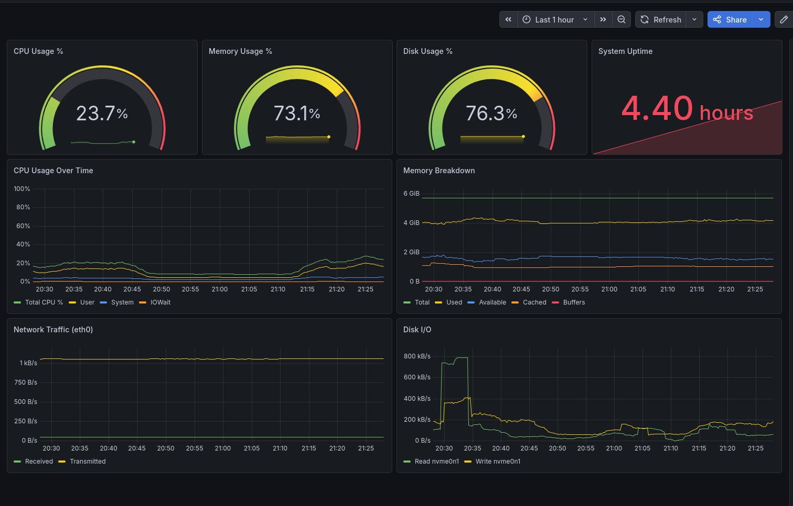

_Gambar pendukung bersumber dari halaman 45 laporan asli._

### Uraian Langkah

Tampilan keseluruhan dari dashboard 'Docker Host Overview' yang menampilkan metrik level host.

### Analisis Teknis

Dashboard menyajikan CPU Usage, Memory Usage, Disk Usage, Uptime, System, Network Traffic, serta Disk I/O. Dashboard mengandalkan data scrape dari node-exporter untuk merender grafik dan gauge.

## 6.8 Screenshot 8: Dashboard Docker Host Overview (Saat Stress Test)

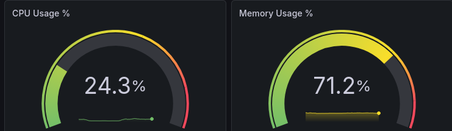

_Gambar pendukung bersumber dari halaman 46 laporan asli._

### Uraian Langkah

Dashboard Docker Host Overview yang menampilkan lonjakan metrik ketika dilakukan stress test menggunakan tool stress.

### Analisis Teknis

Terdapat peningkatan signifikan pada gauge CPU Usage dan metrik lainnya, membuktikan bahwa bahwa tools monitoring bekerja secara real-time untuk mendeteksi resource usage yang tidak wajar.

## 6.9 Screenshot 9: Dashboard Container Metrics - CPU per Container

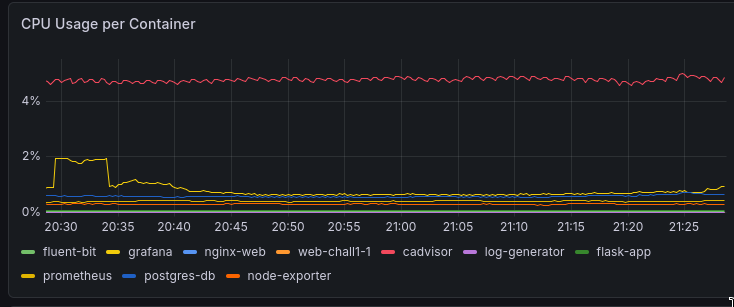

_Gambar pendukung bersumber dari halaman 46 laporan asli._

### Uraian Langkah

Grafik CPU usage dari dashboard 'Container Metrics' yang mengukur penggunaan prosesor masing-masing container.

### Analisis Teknis

Grafik ini bersumber dari metrik cAdvisor (container_cpu_usage_seconds_total) untuk menganalisis beban CPU dari setiap environment container.

## 6.10 Screenshot 10: Dashboard Container Metrics - Memory per Container

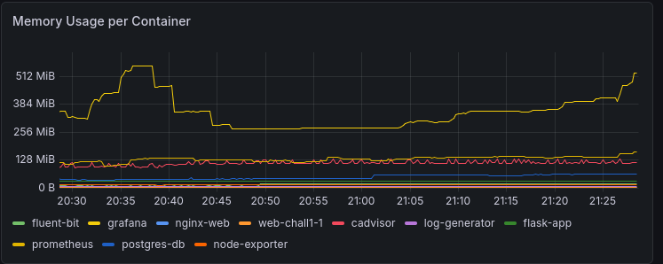

_Gambar pendukung bersumber dari halaman 47 laporan asli._

### Uraian Langkah

Grafik Memory usage dari dashboard 'Container Metrics' yang memaparkan data pemakaian memori container.

### Analisis Teknis

Melalui query container_memory_usage_bytes, panel ini menampilkan besaran bytes RAM yang teralokasi, yang penting untuk mendeteksi potensi Out of Memory (OOM) pada container.

## 6.11 Screenshot 11: Dashboard Log Analytics - Log Volume Time-Series

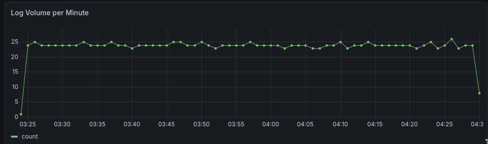

_Gambar pendukung bersumber dari halaman 47 laporan asli._

### Uraian Langkah

Panel time-series pada dashboard Log Analytics yang menyajikan jumlah log yang diproses per menit.

### Analisis Teknis

Data ditarik menggunakan query agregasi date_trunc terhadap tabel log PostgreSQL. Visualisasi time-series mempermudah identifikasi anomali, seperti lonjakan drastis dalam pembentukan log (log storm).

## 6.12 Screenshot 12: Dashboard Log Analytics - Pie Chart Level Distribution

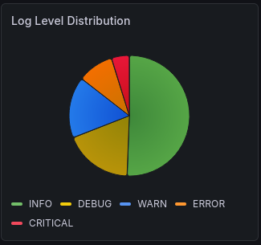

_Gambar pendukung bersumber dari halaman 48 laporan asli._

### Uraian Langkah

Diagram lingkaran (pie chart) distribusi severity dari log, seperti INFO, DEBUG, WARN, ERROR, dan CRITICAL.

### Analisis Teknis

Membantu menyoroti persentase tiap tingkatan error yang dikumpulkan. Dapat dipantau jika level ERROR atau CRITICAL mendadak mendominasi, menampilkan stabilitas sistem bermasalah.

## 6.13 Screenshot 13: Custom Panel - Flask HTTP Requests

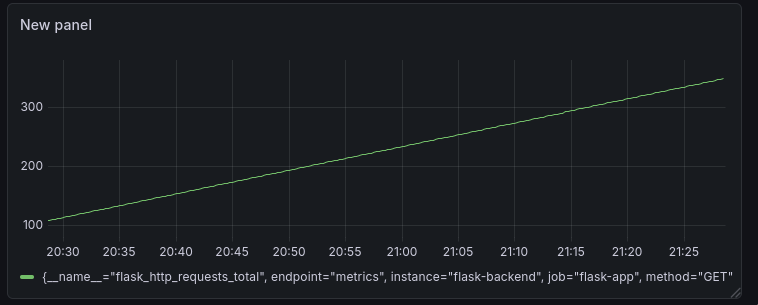

_Gambar pendukung bersumber dari halaman 48 laporan asli._

### Uraian Langkah

Panel visualisasi custom yang dibuat manual untuk menampilkan metrik spesifik flask_http_requests_total.

### Analisis Teknis

Menunjukkan pemahaman dalam membuat kustomisasi query PromQL pada Grafana untuk melacak endpoint hits berdasarkan route (misal route index dan route /metrics).

## 6.14 Screenshot 14: Alerting Rules - Daftar Alert yang Dikonfigurasi

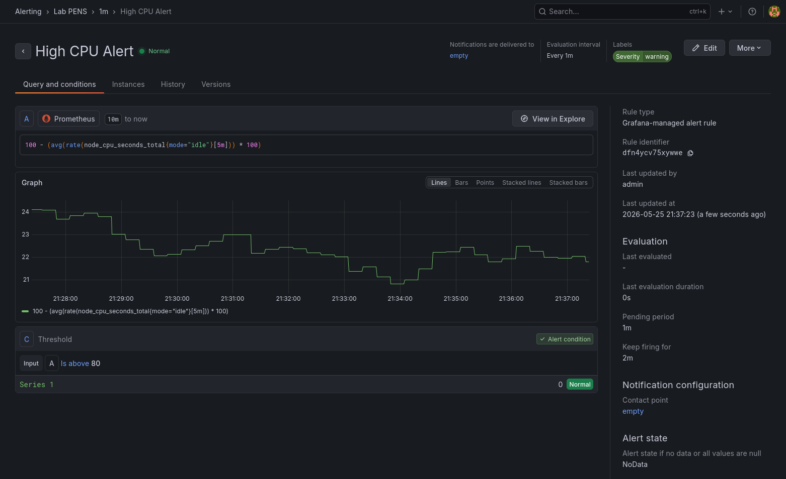

_Gambar pendukung bersumber dari halaman 49 laporan asli._

### Uraian Langkah

Daftar konfigurasi aturan alert yang berada dalam tab Alerting Rules pada antarmuka Grafana.

### Analisis Teknis

Alerting dikonfigurasi guna memberikan pemberitahuan secara otomatis apabila metrik (seperti CPU > 80% selama 2 menit) melebihi batas (threshold) yang telah ditetapkan.

## 6.15 Jawaban Post-Lab Modul 6 (Bagian 1)

Berikut adalah jawaban dan analisis untuk pertanyaan post-lab Modul 6 nomor 1-2.

### Pembahasan Jawaban

1. Container yang paling banyak menggunakan CPU adalah cadvisor, and memory paling banyak digunakan oleh grafana. Hal ini dikarenakan cadvisor terus menerus mengumpulkan metrik dari banyak container sementara Grafana menjalankan layanan web dan rendering visualisasi berat di memory.
2. CPU usage di Grafana terukur ∼25% untuk metriknya secara spesifik dan utilitas program (seperti stress) mencapai ∼60%, sejalan dengan metrik node exporter dengan utilitas host seperti top/htop.

## 6.16 Jawaban Post-Lab Modul 6 (Bagian 2)

Berikut adalah jawaban dan analisis untuk pertanyaan post-lab Modul 6 nomor 3-5. topk(3, container_memory_usage_bytes{ container!="", image!="" } )

### Pembahasan Jawaban

3. Query PromQL topk digunakan untuk menyaring 3 record teratas berdasarkan ukuran alokasi memori bytes, memastikan hasil tidak menampilkan nilai metrik tak terdefinisi.
4. Rasio ERROR vs INFO = 114 ERROR dari 1005 INFO (sekitar 11.3%). Tingkat ini 'definitely not normal for produksi'. Jumlah error yang melebihi batas 1-5% biasanya menandakan sistem bermasalah secara signifikan di lingkungan produksi.
5. Data historis masih 'exist' (ada) karena metrik disimpan pada named volume Docker (prom-data). Mekanisme volume memastikan siklus hidup storage terpisah dari siklus hidup container.
