# Modul 6: Grafana Service dan Monitoring Resource
1.  docker compose ps — 9 service running

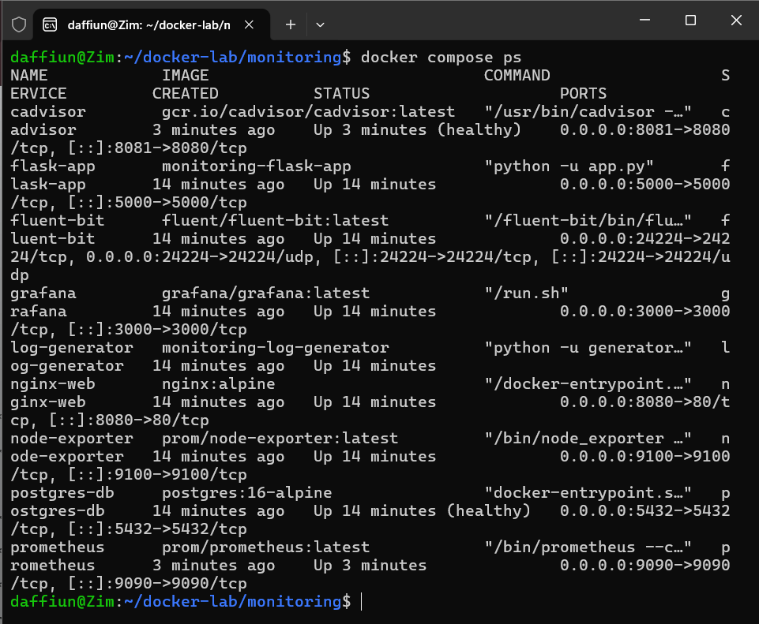

2.  Prometheus Targets — semua status UP

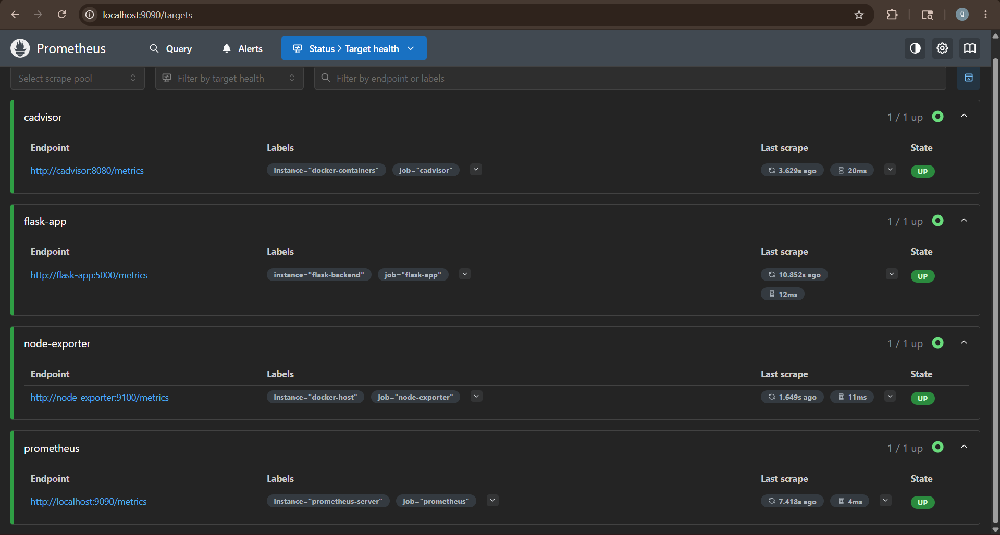

3.  Prometheus query browser — PromQL CPU usage

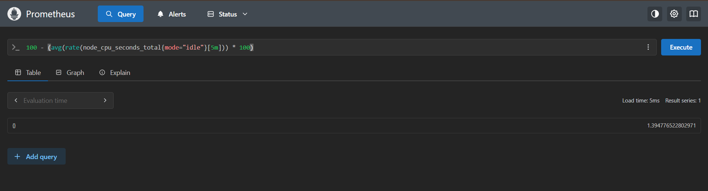

4.  curl localhost:5000/metrics — Flask Prometheus metrics

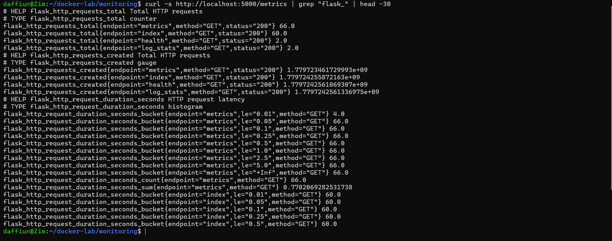

5.  Grafana login — halaman utama setelah login

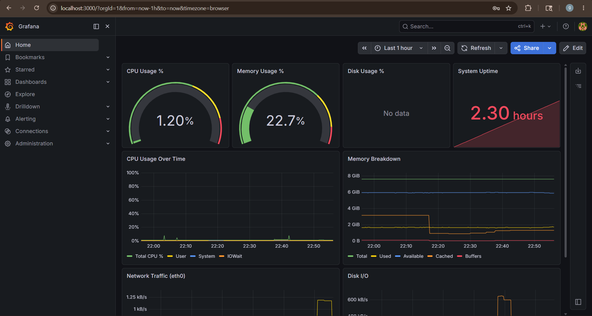

6.  Data sources — Prometheus dan PostgreSQL keduanya OK

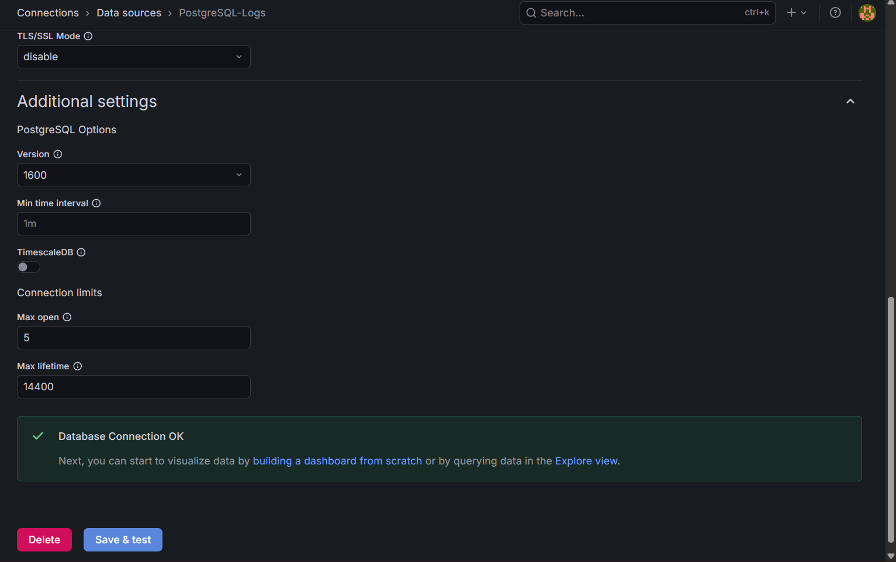

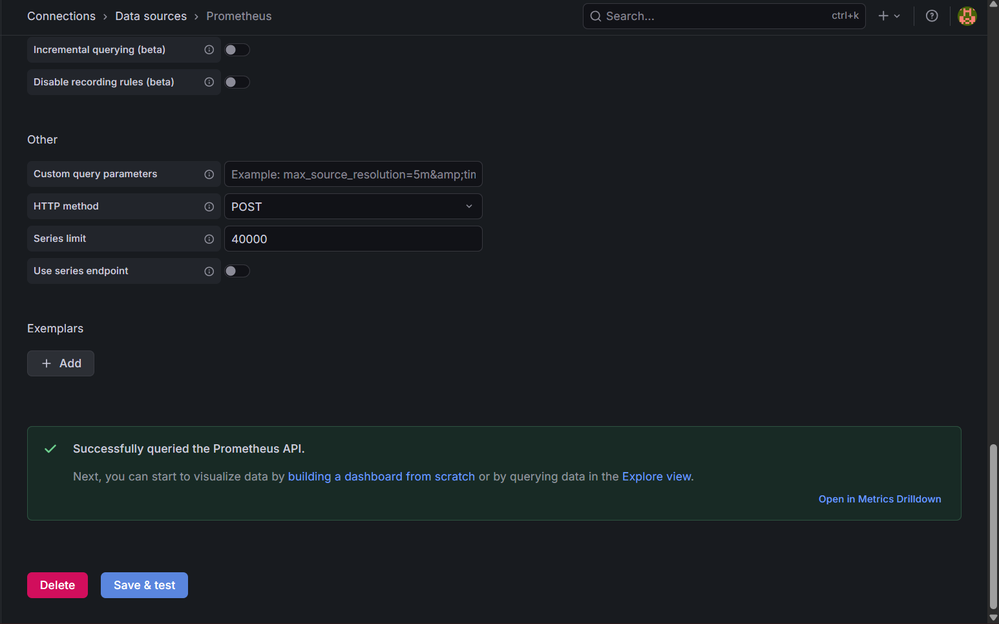

7.  Dashboard Docker Host Overview — keseluruhan

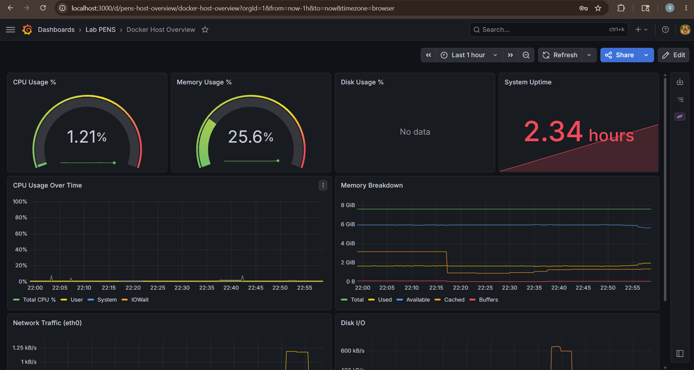

8.  Dashboard Docker Host Overview — gauge CPU/Memory saat stress test (lonjakan terlihat)

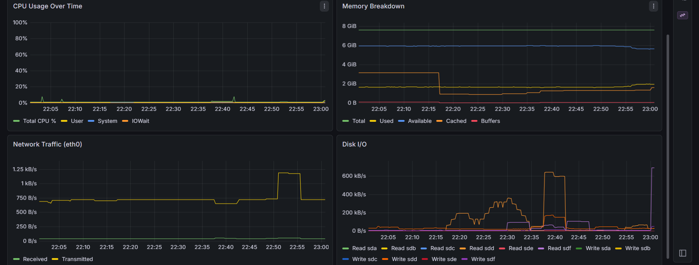

lonjakan di ujung warna ungu

9.  Dashboard Container Metrics — CPU per container

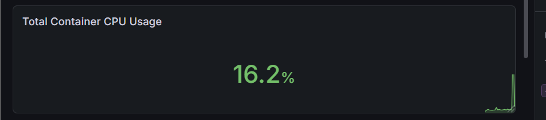

10. Dashboard Container Metrics — Memory per container

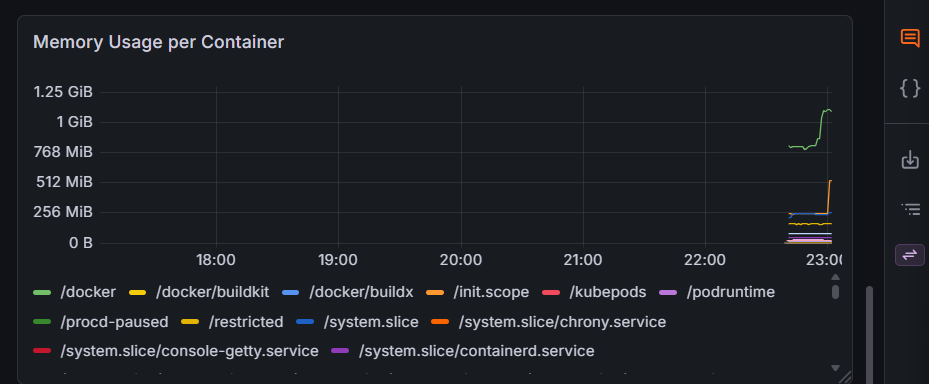

11. Dashboard Log Analytics — log volume time-series

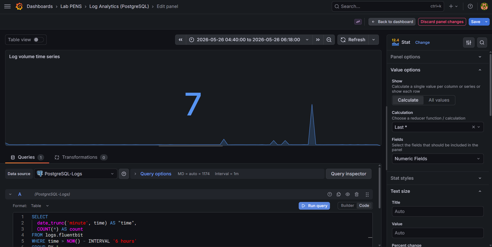

12. Dashboard Log Analytics — pie chart level distribution

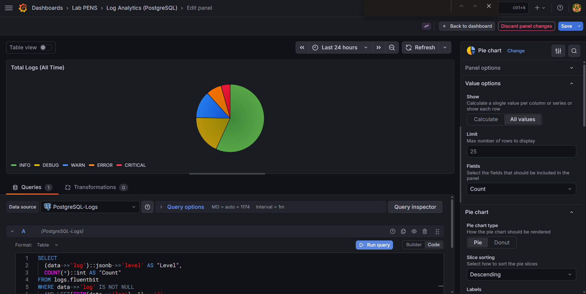

13. Custom panel yang dibuat — Flask HTTP Request

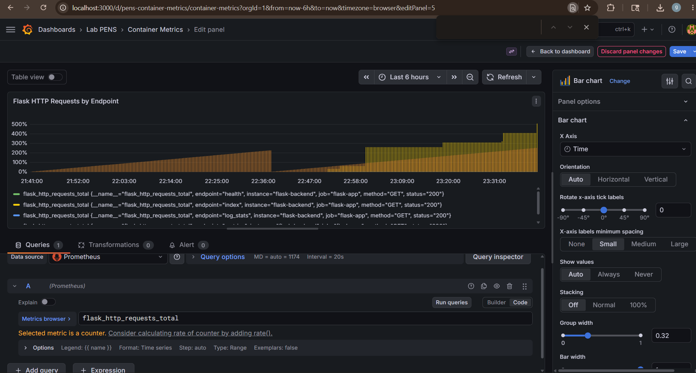

14. Alerting rules — daftar alert yang dikonfigurasi

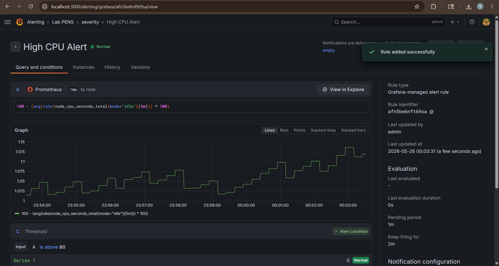

15. Post Test

1.  Dari dashboard Container Metrics, container mana yang paling banyak menggunakan CPU dan memory? Mengapa?

Berdasarkan dashboard Container Metrics, penggunaan CPU terbesar terlihat pada /restricted sekitar 3.69%, diikuti oleh /docker sekitar 3.16%. Label /restricted dan /docker muncul karena cAdvisor pada environment WSL2/Docker Desktop membaca penggunaan resource berdasarkan Linux cgroup path, bukan langsung nama container Docker Compose. Nilai /docker cukup tinggi karena mencerminkan aktivitas container runtime Docker secara keseluruhan, termasuk Prometheus, Grafana, PostgreSQL, Flask App, Fluent Bit, dan container lain yang sedang berjalan. Oleh karena itu, penggunaan CPU terbesar terlihat pada grup proses Docker dibanding service individual.

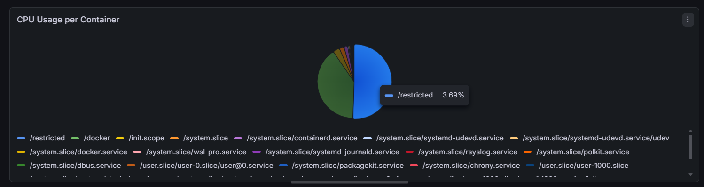

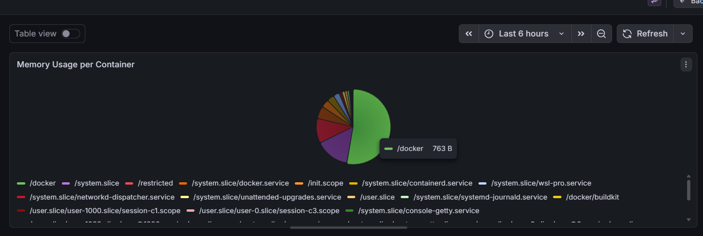

2.  Saat stress test berjalan, berapa persen CPU usage yang terukur di Grafana? Bandingkan dengan output top atau htop di host.

Saat stress test dijalankan menggunakan stress --cpu 2 --timeout 60, penggunaan CPU pada dashboard Grafana meningkat menjadi sekitar 34.7%. Pada saat yang sama, output top/htop pada host menunjukkan penggunaan CPU sekitar 100%.
Nilai antara Grafana dan top tidak selalu identik karena Grafana memperoleh data dari Prometheus menggunakan proses scraping dan fungsi rate() dalam interval waktu tertentu, sedangkan top/htop menampilkan kondisi CPU secara lebih real-time. Namun keduanya tetap menunjukkan pola yang sama, yaitu kenaikan penggunaan CPU saat stress test dijalankan.

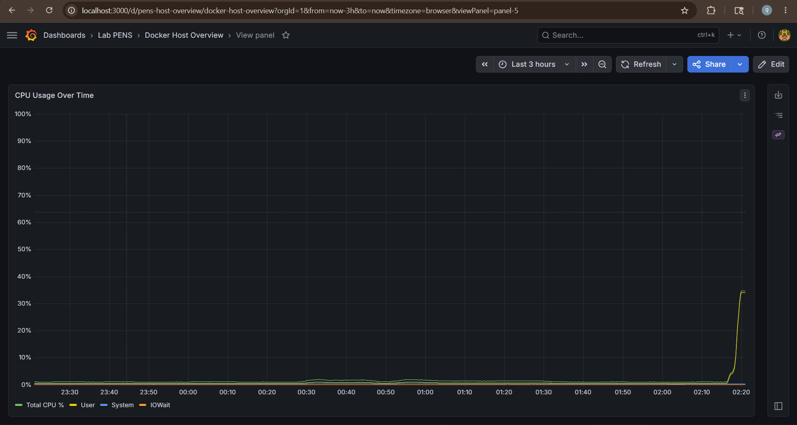

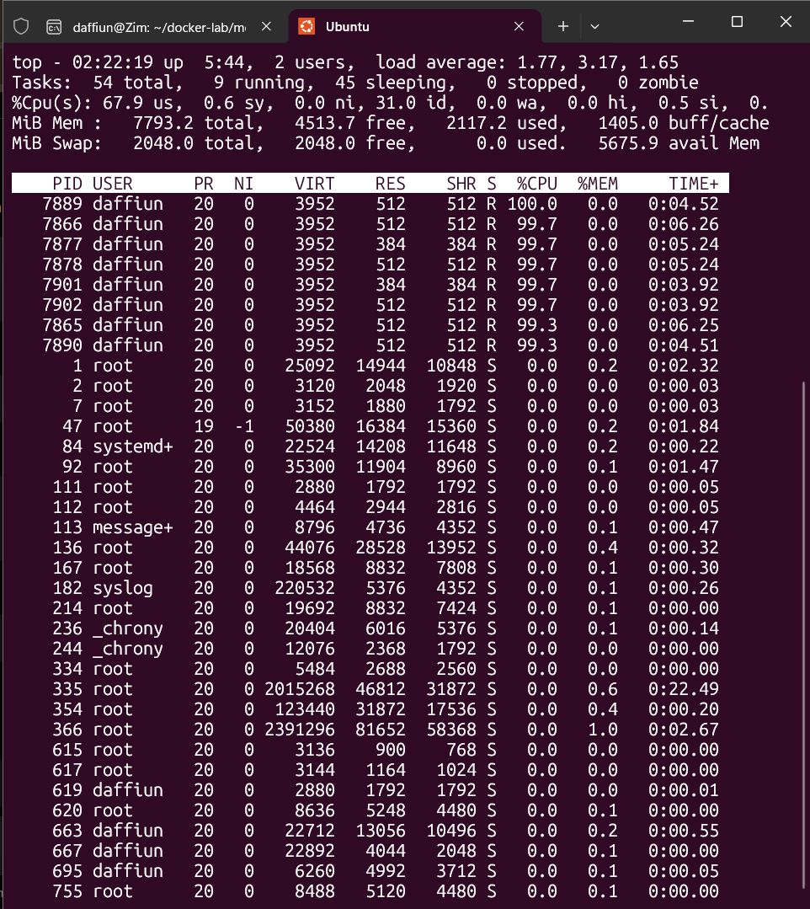

3.  Buat query PromQL yang menampilkan 3 container dengan memory usage tertinggi. Tunjukkan query dan hasilnya.

topk(3, sum by (id) (container_memory_usage_bytes{id!="/"}) / 1024 / 1024)

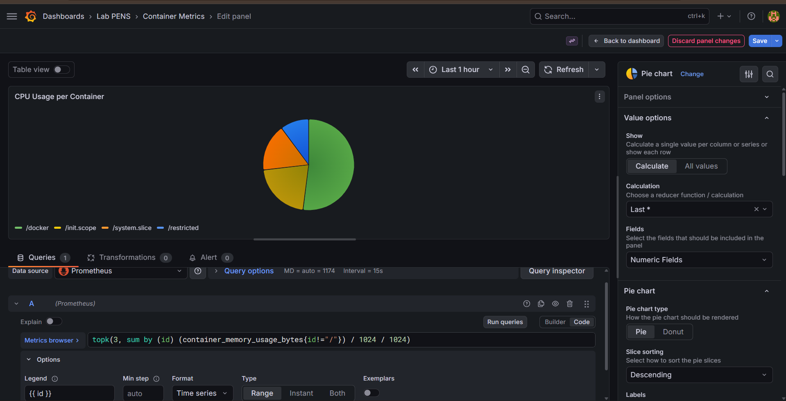

4.  Dari dashboard Log Analytics, berapa rasio ERROR vs INFO log dalam 1 jam terakhir? Apakah ini normal untuk aplikasi production?

Berdasarkan dashboard Log Analytics pada panel Log Level Distribution, jumlah log INFO jauh lebih banyak dibanding log ERROR. Dari hasil pengamatan, log INFO sekitar 1260, sedangkan log ERROR sekitar 162. Dengan demikian rasio ERROR terhadap INFO adalah sekitar 12.9%.
Untuk aplikasi production, rasio error sebesar 12.9% tergolong cukup tinggi dan biasanya tidak dianggap normal, karena log ERROR seharusnya jauh lebih sedikit dibanding log INFO. Namun pada praktikum ini kondisi tersebut masih wajar karena sistem menggunakan log-generator untuk mensimulasikan berbagai level log, termasuk ERROR dan CRITICAL, agar dapat digunakan untuk pengujian monitoring dan analisis log.

5.  Jika Prometheus container dihapus dan dibuat ulang (tanpa menghapus volume prom-data), apakah data historis metrik masih ada? Buktikan.

Sebelum menghapus

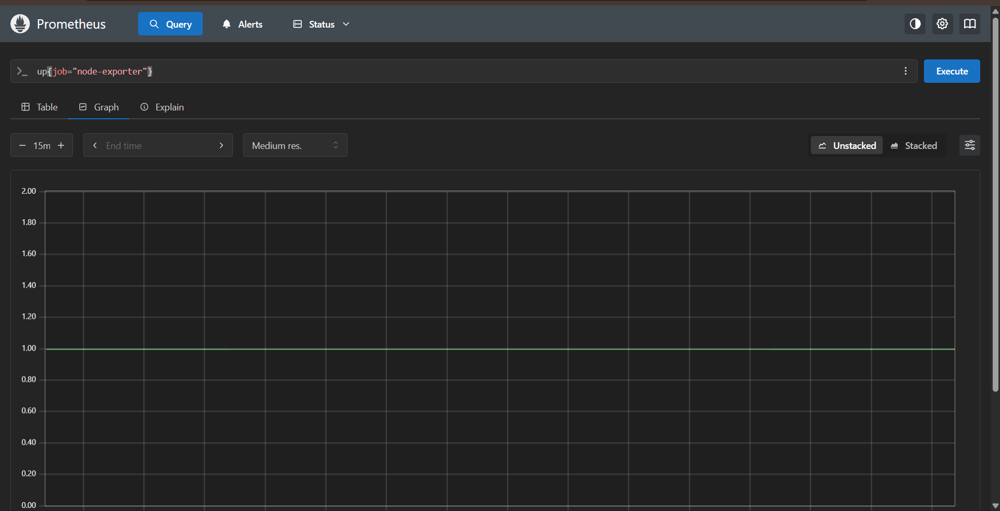

setelah itu menjalankan docker rm -f prometheus untuk menghapus container prometheus saja. Dilanjutkan dengan docker compose up -d prometheus untuk menghidupkan container lagi dan sleep 20 untuk menunggu.

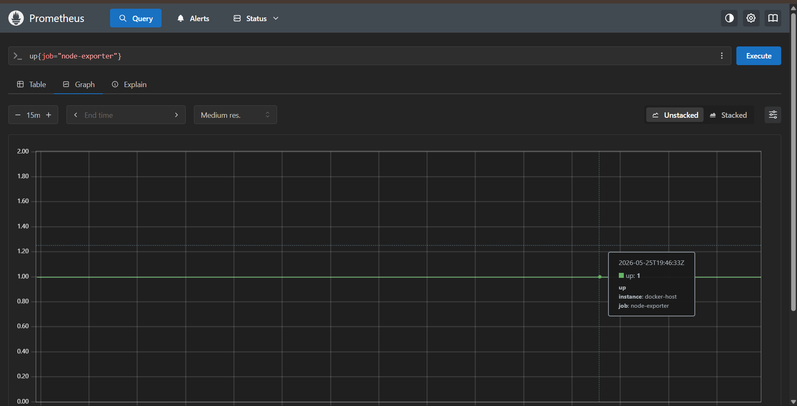

data historis metrik masih ada setelah container Prometheus dihapus dan dibuat ulang, selama volume prom-data tidak dihapus. Hal ini dibuktikan dengan grafik Prometheus yang masih menampilkan data metrik sebelum container Prometheus dihapus. Penyebabnya adalah Prometheus menyimpan time-series database di Docker volume prom-data, bukan hanya di filesystem container. Data historis baru hilang jika volume ikut dihapus, misalnya menggunakan docker compose down -v.
